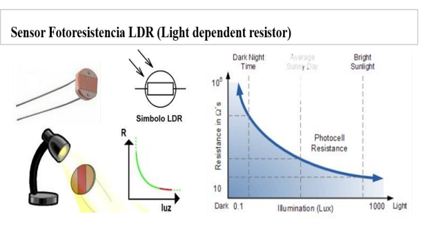
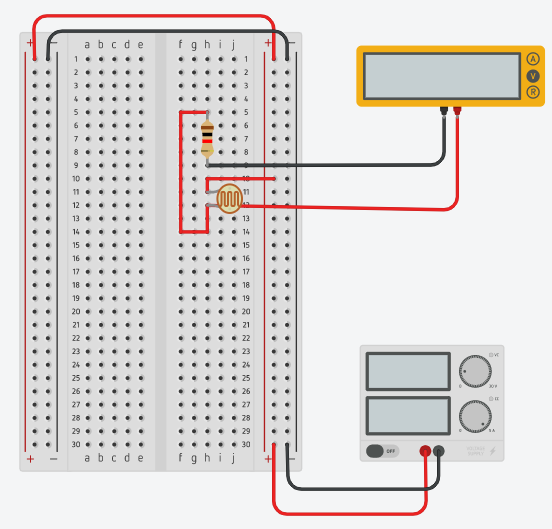
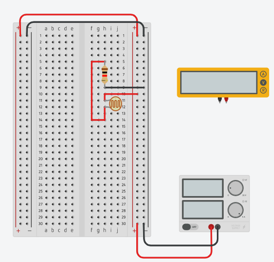
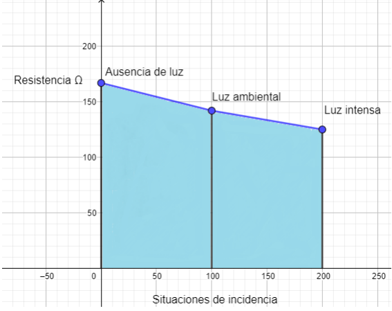
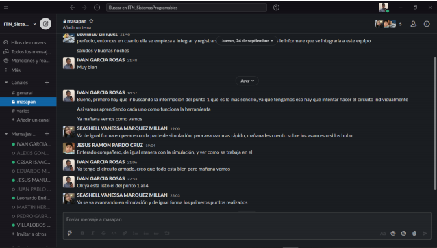
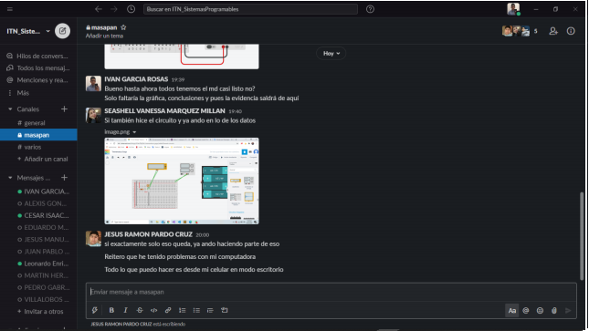

# Introducción

## :trophy: A.1.2 Actividad de aprendizaje

## Objetivo

Realizar un sensor medidor de luz (lux) a través de un circuito electrónico, utilizando un simulador, y  un **LDR (Light dependent Resistor)**.

### :blue_book: Instrucciones

- Se sugiere para el desarrollado de la presenta actividad, utilice uno de los siguientes simuladores: [Autodesk Tinkercad](https://www.tinkercad.com/), [Virtual BreadBoard](http://www.virtualbreadboard.com/), [Easy EDA](https://easyeda.com/) por lo cual habrá que familiarizarse antes, e incluso instalarse o registrarse dentro de la plataforma.
- Toda actividad o reto se deberá realizar, utilizando el estilo **MarkDown con extension .md** y el entorno de desarrollo VSCode, debiendo ser elaborado como un documento **single page**, es decir si el documento cuanta con imágenes, enlaces o cualquier documento externo debe ser accedido desde etiquetas y enlaces, y debe ser nombrado con la nomenclatura **A1.2_NombreApellido_Equipo.pdf.**
- Es requisito que el .MD contenga una etiqueta del enlace al repositorio de su documento en GITHUB, por ejemplo **Enlace a mi GitHub** y al concluir el reto se deberá subir a github.
- Desde el archivo **.md** exporte un archivo **.pdf** que deberá subirse a classroom dentro de su apartado correspondiente, sirviendo como evidencia de su entrega, ya que siendo la plataforma **oficial** aquí se recibirá la calificación de su actividad.
- Considerando que el archivo .PDF, el cual fue obtenido desde archivo .MD, ambos deben ser idénticos.
- Su repositorio ademas de que debe contar con un archivo **readme**.md dentro de su directorio raíz, con la información como datos del estudiante, equipo de trabajo, materia, carrera, datos del asesor, e incluso logotipo o imágenes, debe tener un apartado de contenidos o indice, los cuales realmente son ligas o **enlaces a sus documentos .md**, _evite utilizar texto_ para indicar enlaces internos o externo.
- Se propone una estructura tal como esta indicada abajo, sin embargo puede utilizarse cualquier otra que le apoye para organizar su repositorio.
  
```
- readme.md
  - blog
    - C0.1_x.md
    - C0.2_x.md
  - img
  - docs
    - A0.1_x.md
    - A0.2_x.md
    - A1.2_x.md
    - A1.3_x.md
```


### :pencil2: Desarrollo

1. Utilice el siguiente listado de materiales para la elaboración de la actividad y agregue en la columna Fuente de consulta su enlace _bibliográfico_.

    | Cantidad | Descripción                      | Fuente de consulta |
    | -------- | -------------------------------- | ------------------ |
    | 1        | Sensor Fotoresistencia LDR de 2M | [MecatronicaLatam.com](https://www.mecatronicalatam.com/es/tutoriales/sensores/sensor-de-luz/ldr/)    - [Prometec.mx](https://prometec.mx/producto/ldr-sensor-de-luz/) - [Naylampmechatronics.com](https://naylampmechatronics.com/sensores-luz-y-sonido/241-sensor-ldr-5528.html)                   |
    | 1        | Resistencia 1k                   | [Neoteo.com](https://www.neoteo.com/electronica-basica-ley-de-ohm-resistencias/)                   |
    | 1        | Fuente de alimentación de 5v.    |  [Ingmecafenix.com](https://www.ingmecafenix.com/electronica/fuente-de-alimentacion/)                  |


2. Considerando que el elemento LDR es un sensor fotoresistivo es decir varia su resistencia en base a la cantidad de luz que incide sobre el, **¿Qué observa en el grafico siguiente?** 
   
   <p align="center">
    
   </p>

     La gráfica nos indica que a medida que la luz va en aumento la resistencia va en decremento, y cuando la luz decrece la resistencia comienza a crecer, lo que nos indica la siguiente inferencia:
   - A mayor luz poca resistencia
   - A menor luz gran resistencia
   
3. Ensamble el circuito que se muestra utilizado el simulador que halla considerado, colocando la fotorresistencia en la posición LDR y resistencia de acuerdo con la imagen del esquemático:

    <p align="center"> 
        
    </p>
4. Coloque la imagen finalmente obtenida del circuito ensamblado dentro de su simulador.
   
     <p align="center"> 
        

    Circuito desconectado del multimetro para una mejor visualizacion del mismo

    <p align="center"> 
        

5. Mida la **resistencia** de la fotorresistencia con el ohmetro bajo las siguientes condiciones: ausencia de luz u oscuridad,  luz ambiente, luz intensiva y registre en la tabla correspondiente.

     

6. Calcule el **valor de voltaje Vout teórico** para cada una de las condiciones antes indicadas asi como el valor de voltaje Vout medido  y registre en la tabla correspondiente.

    

7. Calcule el **valor de exactitud** de voltaje entre lo teórico y lo medido para cada condición  y registre en la tabla correspondiente.

    | Condicion          |  Impedancia en fotoresistencia | Voltaje Vout teórico | Voltaje Vout medido | %  V.Medido/ V.Teórico | 
    | --------------- | ----------------------------- | -------------------- | ------------------- | ---------------------- | ---------------------- |
    | Ausencia de luz | 167 ohm | 1000 / 180000 + 1000 * 5 = 0.0276v | 0.027v | 0.027 / 0.0276 = 0.97% | 
    | Luz ambiental   | 142 ohm | 1000 / 912 + 1000 * 5 = 2.6150v | 2.61v | 2.61 / 2.6150 = 0.99% | 
    | Luz intensa     | 125 ohm | 1000 / 506 + 1000 * 5 = 3.32v | 3.32v | 3.32 / 3.32 = 1% | 

8. **Grafique** a través de los valores registrados en la tabla anterior de tal manera que se pueda observar el comportamiento de la curva del componente LDR e **inserte la grafica**.

    <p align="center"> 
        

9.  Inserte imágenes de **evidencias** tales como son reuniones  de los integrantes del equipo realizadas para el desarrollo de la actividad

     <p align="center"> 
        
    
     <p align="center"> 
        
    
     <p align="center"> 
        
        
     <p align="center"> 
        

10.  Incluya las conclusiones individuales y resultados observados durante el desarrollo de la actividad.


        **Garcia Rosas Ivan**

        Pude observar con mejor detenimiento el comportamiento de los componentes utilizados y como medirlos, ya que no estoy muy familiarizado con esto, pero mas que nada me hizo pensar en las cosas que se pueden hacer con la fotorresistencia y su comportamiento con la luz, como programar algún sistema automatizado o algo así. Pero enfocado específicamente a la práctica, se pudo aprecia cómo se comporta, pero creo que habría sido mas claro o evidente el comportamiento si hubiera sido de manera física, con componentes reales, porque podríamos haber visto el cambio mucho más claro.

        **Pardo Cruz Jesús Ramón**

        Pues he tenido un encuentro anterior con las fotos resistencias, pero en aparatos ya ensamblados para su uso, y que puedo decir, es interesante cómo funcionan, el hecho de que a poco o nada luz reaccionen de manera increíble y en su caso el contrario sea al revés, con esta práctica me queda más claro,  esto está  enfocado más que nada a la luz de noche a mi parecer ya que al momento de recibir menos luz a la fotorresistencia, más posibilidades tenemos en sus usos o su aplicación en problemas o situaciones en la vida cotidiana o laboral.

        **Marquez Millan Seashell Vanessa** 

        Después de hacer esta práctica aprendí sobre la existencia de este tipo de resistencia LDR, me quedo más claro cómo es que funcionan al hacer la simulación y estar jugando con la intensidad y al mismo tiempo medir con el multímetro las diferentes cantidades, pude adquirir el conocimiento del cómo funciona esta resistencia, de igual forma el colocar un led después de dicha fotorresistencia hace más evidente lo que sucede con ella, que ante mayor luz mayor resistencia y ante menor luz menor resistencia.


### :bomb: Rubrica

| Criterios     | Descripción                                                                                  | Puntaje |
| ------------- | -------------------------------------------------------------------------------------------- | ------- |
| Instrucciones | Se cumple con cada uno de los puntos indicados dentro del apartado Instrucciones?            | 10      |  | 5 |
| Desarrollo    | Se respondió a cada uno de los puntos solicitados dentro del desarrollo de la actividad?     | 60      |
| Demostración  | El alumno se presenta durante la explicación de la funcionalidad de la actividad?            | 20      |
| Conclusiones  | Se incluye una opinión personal de la actividad  por cada uno de los integrantes del equipo? | 10      |

:triangular_flag_on_post: [Ir a repositorio](https://github.com/seashelltec/SistemasProgramables/blob/master/blog/A1.2_SeashellMarquez_Masapan.md)