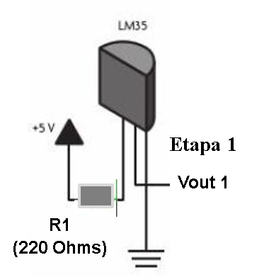
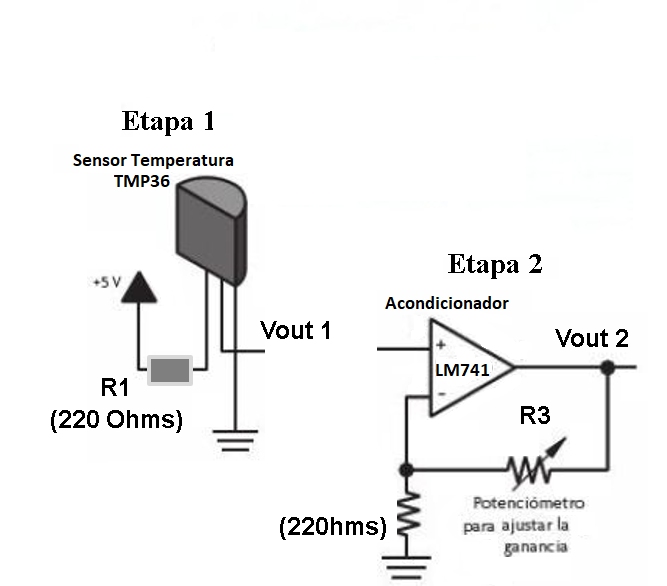
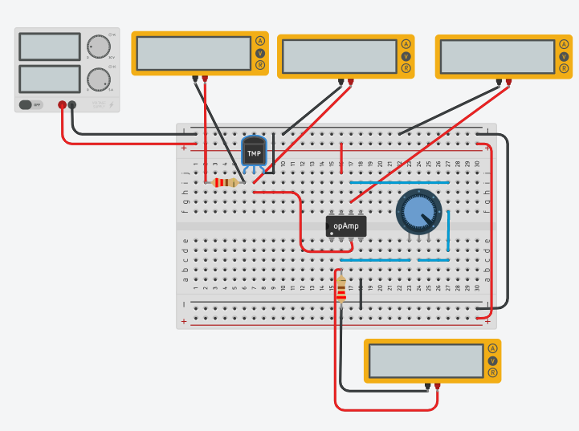
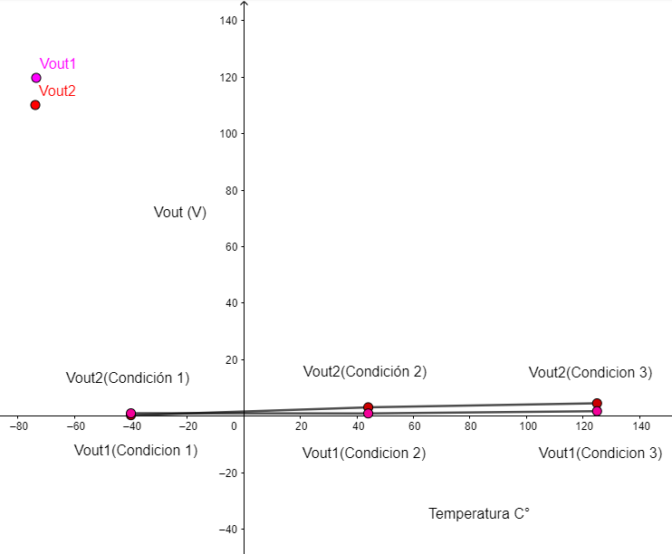
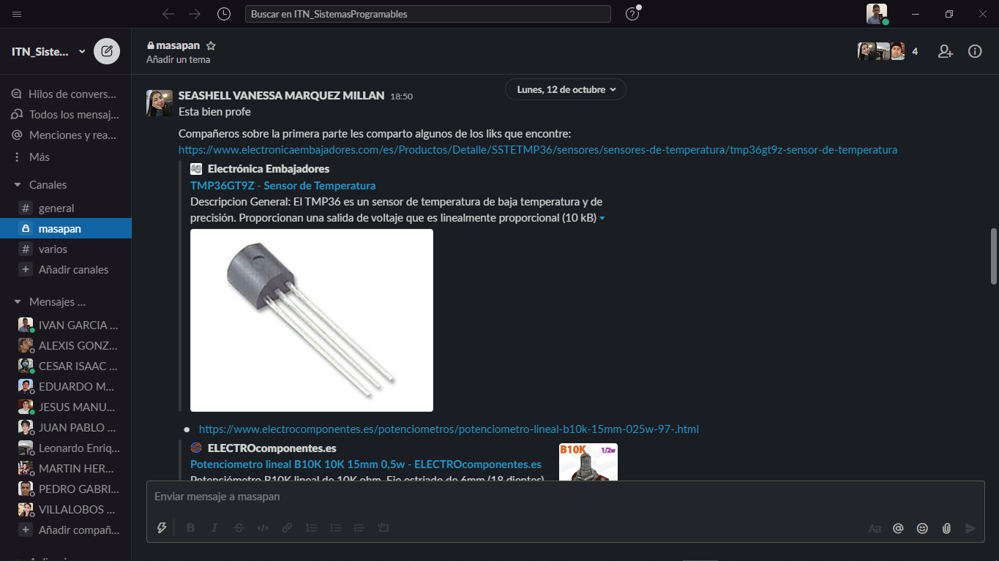
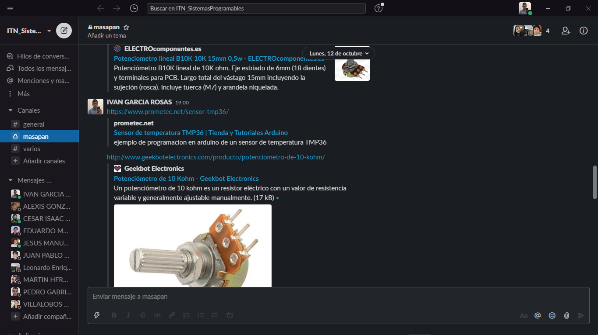
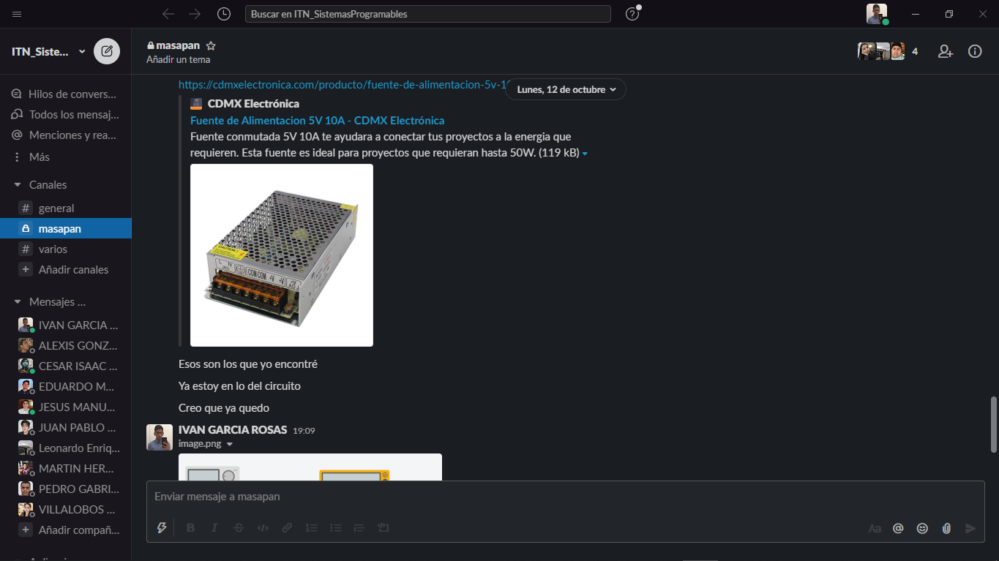
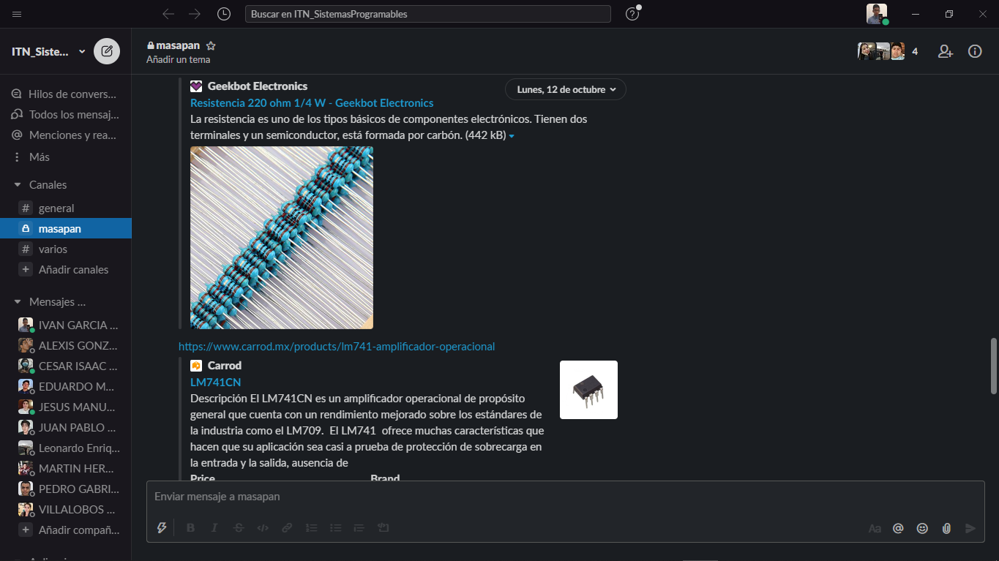
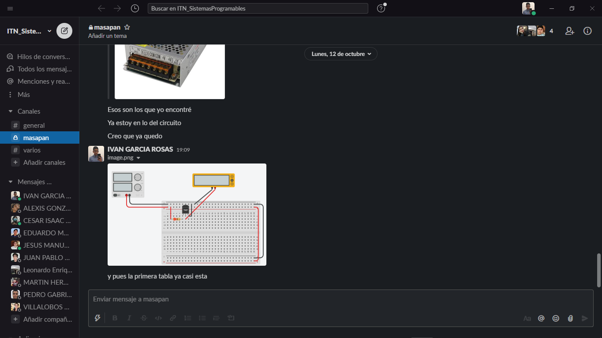

# Sensores

## :trophy: A.1.4 Actividad de aprendizaje

## Objetivo

Realizar un sensor medidor de temperatura a través de un circuito electrónico, utilizando un simulador, y  un **Transistor TMP36** lineal de temperatura y un **amplificador operacional LM741**.

## :blue_book: Instrucciones

- Se sugiere para el desarrollado de la presenta actividad, utilice uno de los siguientes simuladores: [Autodesk Tinkercad](https://www.tinkercad.com/), [Virtual BreadBoard](http://www.virtualbreadboard.com/), [Easy EDA](https://easyeda.com/) por lo cual habrá que familiarizarse antes, e incluso instalarse o registrarse dentro de la plataforma.
- Toda actividad o reto se deberá realizar utilizando el estilo **MarkDown con extension .md** y el entorno de desarrollo VSCode, debiendo ser elaborado como un documento **single page**, es decir si el documento cuanta con imágenes, enlaces o cualquier documento externo debe ser accedido desde etiquetas y enlaces, y debe ser nombrado con la nomenclatura **A1.4_NombreApellido_Equipo.pdf.**
- Es requisito que el .md contenga una etiqueta del enlace al repositorio de su documento en GITHUB, por ejemplo **Enlace a mi GitHub** y al concluir el reto se deberá subir a github.
- Desde el archivo **.md** exporte un archivo **.pdf** que deberá subirse a classroom dentro de su apartado correspondiente, sirviendo como evidencia de su entrega, ya que siendo la plataforma **oficial** aquí se recibirá la calificación de su actividad.
- Considerando que el archivo .PDF, el cual fue obtenido desde archivo .MD, ambos deben ser idénticos.
- Su repositorio ademas de que debe contar con un archivo **readme**.md dentro de su directorio raíz, con la información como datos del estudiante, equipo de trabajo, materia, carrera, datos del asesor, e incluso logotipo o imágenes, debe tener un apartado de contenidos o indice, los cuales realmente son ligas o **enlaces a sus documentos .md**, _evite utilizar texto_ para indicar enlaces internos o externo.
- Se propone una estructura tal como esta indicada abajo, sin embargo puede utilizarse cualquier otra que le apoye para organizar su repositorio.
  
```
- readme.md
  - blog
    - C0.1_x.md
    - C0.2_x.md
  - img
  - docs
    - A0.1_x.md
    - A0.2_x.md
    - A1.2_x.md
    - A1.3_x.md
```

## :pencil2: Desarrollo

1. Utilice el siguiente listado de materiales para la elaboración de la actividad

    | Cantidad | Descripción                       | Fuente de consulta |
    | -------- | --------------------------------- | ------------------ |
    | 1        | Sensor temperatura TMP36          | [Sensor TMP36 - Prometec](https://www.prometec.net/sensor-tmp36/) |
    | 1        | Potenciómetro 10k                 | [Potenciómetro 10k - GeekbotElectronics](http://www.geekbotelectronics.com/producto/potenciometro-de-10-kohm/) |
    | 2        | Resistencias de 220               | [Resistencias de 220 - GeekbotElectronics](http://www.geekbotelectronics.com/producto/resistencia-220-ohm-14-w/) |
    | 1        | Amplificador LM741                | [Amplificador LM741 - Carrod](https://www.carrod.mx/products/lm741-amplificador-operacional) |
    | 1        | Fuente de alimentación de 5Volts | [Fuente de alimentación de 5Volts - CDMXElectronica](https://cdmxelectronica.com/producto/fuente-de-alimentacion-5v-10a/) |

    Para mayor información acceder a los siguientes enlaces:

    - Información y especificaciones del [Sensor TMP36](https://components101.com/sites/default/files/component_pin/TMP36-Sensor-Pinout.png)  
    - Información y especificaciones del [Amplificador operacional LM741](https://ortegamraul.files.wordpress.com/2014/03/741-interno.png)

2. Basado en la imagen ensamble mediante un simulador el circuito electrónico etapa 1, colocando el transistor LM35 en la posición indicada. 

<p align="center">
    
</p>

1. Calcule, mida y registre los valores solicitados para Vout1, bajos las 3 condiciones requeridas en la tabla anexa.

     | Número | Condición | Voltaje Vout1 medido | Voltaje en R1 medido | Temperatura indicada |
     | ------ | --------- | -------------------- | -------------------- | -------------------- |
     | 1      | Mínima    |     99.9 mV          |      11 mV           |         -40°         |
     | 2      | Media     |      949 mV          |      11 mV           |          44°         |
     | 3      | Máxima    |     1.75 V           |      11 mV           |         125°         |

2. Utilizando la imagen del transistor TMP36 que corresponde a la etapa 1, conecte la terminal Vout1 a la terminal no inversora del LM741, y ensamble el circuito correspondiente a la etapa 2.

<p align="center">
    

</p>

   - Circuito armado al completo

<p align="center">
    

</p>

1. ¿**Qué valor deberá tener R3 en el circuito Etapa 2, para lograr obtener Vout2 = 5 volts,** para la condición máxima de temperatura que el sensor es capaz de detectar? Como se puede observar la resistencia R3 corresponde a un potenciómetro, sin embargo se pueden hacer arreglos de resistencias para lograr un ajuste fino.  ¿Cuál cree que sea la razón por la cual se esta solicitando un **ajuste a 5 Volts**?

- R3 debe tener un valor de 500 ohms para que el voltaje en Vout2 sea de 5V
- Se requiere un ajuste a 5V porque el intervalo de voltaje que maneja el sensor es muy bajo ya que va de 0 grados a 100 grados y la diferencia de voltaje es entre 0 y 1 o casi 2 volts lo que resulta difícil de leer en un comparador o ver una diferencia significativa, es por ello que amplificamos la señal.
   
6. Una vez que se ha ajustado el valor R3 dejalo asi y registre los valores solicitados para Vout2, para las 3 condiciones requeridas en la tabla anexa.

     | Número | Condición        | Voltaje en R2 medido | Voltaje en Vout2 medido | Temperatura indicada |
     | ------ | ---------------- | -------------------- | ----------------------- | -------------------- |
     | 1      | Condición mínima |      99.9 mV         |        327 mV           |       -40°           |
     | 2      | Condición media  |       949 mV         |        3.11 V           |        44°           |
     | 3      | Condición máxima |       1.38 V         |        4.53 V           |       125°           |

7. Grafique Vout1 y Vout2, para las tres condiciones anteriores, considerando en "X" los valores de temperatura y para "Y" los valores de voltaje, y coloque dentro de este apartado.

<p align="center">
    

</p>

1. Evidencias

<p align="center">
    

</p>

<p align="center">
    

</p>

<p align="center">
    

</p>

<p align="center">
    

</p>

<p align="center">
    

</p>

--------

### Concluisones
---

  *Marquez Millan Seashell Vanessa*

   En esta practica pude darme cuenta de como es que funciona el voltaje o mejor dicho como se comporta ante ciertos dispositivos, a pregunta numero 5 hizo que reflexionara mas acerca de el como y el porque se estaban conectado, tambien de que investigara sobre otras posibles aplicaciones ya que descubri que ees dificil que un comparador detecte niveles de voltajes muy bajo, aprendi como conectar un amplificador y como es que este se compone.

   *Garcia Rosas Ivan*

   Al realizar el circuito completo como se observa en la etapa 2, el comportamiento del TMP36 junto con el Amplificador LM741 se pudo observar que el voltaje parece no ser suficiente para que al final la salida sea de 5v, además de que el rango de temperatura que maneja el TMP36 es amplio, por lo menos el muy raros casos llegaras a los -40° o a los 125° por lo que tienes un buen rango de lectura.

   *Pardo Cruz Jesús Ramón*

   En esta practica aprendí más acerca de los componentes, en concreto el sensor de temperatura, el potenciometro para regular o limitar el paso de la corriente eléctrica ya que en una pregunta se especifica que se teiene que dar una salida específica de voltaje. 

___

### :bomb: Rubrica

| Criterios     | Descripción                                                                                  | Puntaje |
| ------------- | -------------------------------------------------------------------------------------------- | ------- |
| Instrucciones | Se cumple con cada uno de los puntos indicados dentro del apartado Instrucciones?            | 10      |
| Desarrollo    | Se respondió a cada uno de los puntos solicitados dentro del desarrollo de la actividad?     | 60      |
| Demostración  | El alumno se presenta durante la explicación de la funcionalidad de la actividad?            | 20      |
| Conclusiones  | Se incluye una opinión personal de la actividad  por cada uno de los integrantes del equipo? | 10      |


:house: [Ir a GitHub - Marquez Millan Seashell Vanessa](https://github.com/seashelltec/SistemasProgramables)

:house: [Ir a GitHub - Garcia Rosas Ivan](https://github.com/GarciaRosasIvan/GarciaRosasIvan_SistemasProgramables/blob/master/README.md)

:house: [Ir a GitHub - Pardo Cruz Jesús Ramón](https://github.com/RamonPardo1580/SistemasProgramables-blog)