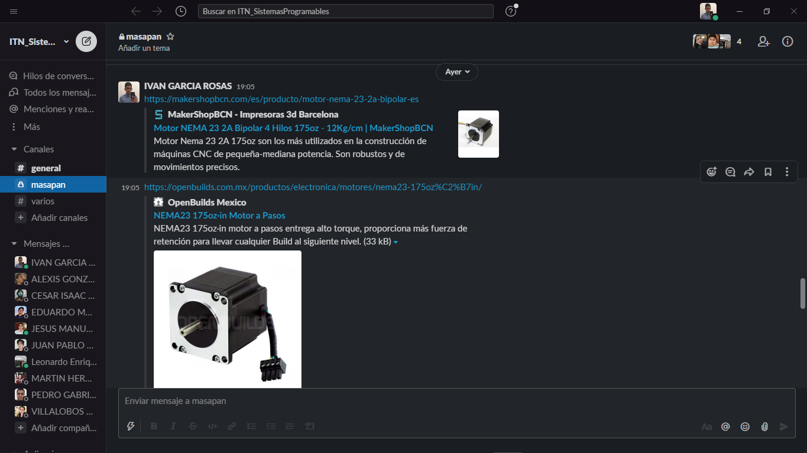
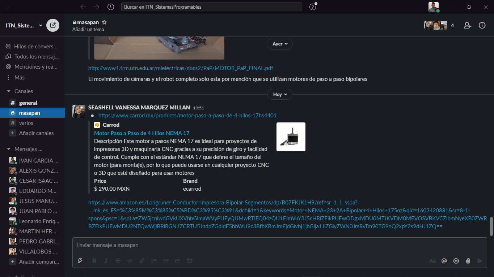

# Actuadores

## :trophy: A.2.1 Actividad de aprendizaje

**Tipos de actuadores eléctricos comerciales**

### :blue_book: Instrucciones

1. Cada equipo deberá elaborar su presentación de acuerdo con el modelo del actuador eléctrico que el asesor le indique.
2. Los temas deberán exponerse en clase por todos los integrantes evitando que se perciba la lectura del documento.
3. El tiempo máximo de la presentación deberá ser no mayor a 8 minutos.
4. La actividad será redactada utilizando el estilo ***markdown***.
5. El documento deberá incluir, los elementos indicados en la **rubrica** tales como son portada, introducción, desarrollo, conclusiones e información bibliográfica o enlaces utilizados.
6. El desarrollo deberá incluir características físicas y eléctricas, esquemático, usos aplicativos,  imágenes del actuador, asi como cualquier otra información que considere importante y que le pueda apoyar en el desarrollo de la exposición.
7. El documento deberá contar con la nomenclatura **A2.1_NombreApellido_Equipo**, y se deberá subir a la plataforma classroom en formato PDF dentro del apartado correspondiente a la actividad.
8. El documento elaborado para desarrollar la actividad será compartido en la plataforma colaborativa **GitHub**, dando acceso al asesor para su revisión.

### :pencil2: Desarrollo

1. Utilice el siguiente listado de modelos de actuadores electricos comerciales, para elaborar su actividad de acuerdo con las instrucciones solicitadas por el asesor.

   - [ ] [Motor reductor de doble eje](https://articulo.mercadolibre.com.mx/MLM-651722486-motor-reductor-de-doble-eje-recto-3-vcc-mot-120-_JM?quantity=1#position=3&type=item&tracking_id=36396cb4-7b75-41a3-97e3-a0c6af6709c3) 
   - [ ] [Motor Unipolar paso a paso](https://articulo.mercadolibre.com.mx/MLM-587352935-motor-a-pasos-pm55l-048-unipolar-75-por-paso-con-cables-_JM?quantity=1#position=3&type=item&tracking_id=1a7ba1b9-b483-4d15-889f-2b970c4779c2) 
   - [X] [Motor Bipolar paso a paso](https://articulo.mercadolibre.com.mx/MLM-783827003-motores-a-pasos-nema-23-bipolar-13kg-minebea-japones-arduino-_JM?quantity=1#position=2&type=item&tracking_id=f05c36d1-e3e0-4d19-b76e-8bbd132124fd) 
   - [ ] [Servomotor modelo SG90](https://articulo.mercadolibre.com.mx/MLM-618694358-micro-servomotor-sg90-robotica-arduino-16-kg-servo-motor-_JM?quantity=1&variation=23651072471#position=1&type=item&tracking_id=4b156b79-3721-4fc1-9ef0-4f378d92e1ef)

2. Espere a que el asesor le indique que tipo de sensor sera el que desarrollara su equipo y una vez que tenga marque el sensor dentro del punto anterior.
   
3. Una vez que conoce el tema a desarrollar, investigue y redacte dentro de este documento los puntos siguiente:

   - **Portada**, información del alumno, asesor, carrera, materia, fecha,..
   - **Introduccion**, una breve descripción de que tratara el tema.
   - **Desarrollo**
     - **Definición**.
     - **Imágenes** del actuador.
     - Características **físicas**.
     - Características **eléctricas**.
     - Explique cual el principio de funcionamiento.
     - Usos aplicativos.
     - Se puede apoyarse de un video que no debe durar mas de 1/3 del tiempo de su presentación..
    - **Conclusiones** por cada uno de los integrantes del equipo.
    - **Bibliográfia**, agregue dentro de este apartado toda bibliografia en la cual se apoyo para el desarrollo de la actividad, utilizando etiquetas y los enlaces.

     :books: [Ir a la presentación](PDF/../../PDF/A2.1_Tipos_Actuadores_Comerciales_Motor-bipolar-paso-a-paso.pptx)

     **Bibliografía**
    
    :books: [Motor NEMA 23 2A Bipolar 4 Hilos 175oz - 12Kg/cm. (2020, 28 septiembre). MakerShopBCN.](https://makershopbcn.com/es/producto/motor-nema-23-2a-bipolar-es)

    :books: [NEMA23 175oz·in Motor a Pasos. (s. f.). OpenBuilds Mexico.](https://openbuilds.com.mx/productos/electronica/motores/nema23-175oz%C2%B7in/)

    :books: [Losada G., A. (s. f.). Control de brazo mecánico con motores paso a paso - Robótica. Sites Google.](https://sites.google.com/site/inteligenciarobotica/home/proyectos-de-robotica/control-de-brazo-mecanico-con-motores-paso-a-paso)

    :books: [Motor Paso a Paso. (s. f.). utn.edu.ar.](http://www1.frm.utn.edu.ar/mielectricas/docs2/PaP/MOTOR_PaP_FINAL.pdf)
  
4. Inserte imágenes de **evidencias** tales como son reuniones  de los integrantes del equipo realizadas para el desarrollo de la actividad

    

    

   

   

    

   

   

    

   

   

    

   

5. Incluya las conclusiones individuales y resultados observados durante el desarrollo de la actividad.

   **Marquez Millan Seashell Vanessa**

   Este motor nema 23 y en general los motores a pasos son motores que son muy precisos y además poderosos tomando en cuanta su tamaño y su precio que como podemos notar es elevado y por ende es para proyectos específicos, nos podemos dar cuenta por que hay diferentes tipos de motores para las diferentes aplicaciones es decir no necesitas comprar este tipo de motor si lo que quieres es hacer que funcione una banda, porque en realidad en ese caso no necesitas la precisión que este motor te brinda, pero si en el caso que quisieras hacer una maquina que escriba por ti en papel ya que ocupas movimientos definidos y con poco margen de error o nulo, también aprendí como identificar a simple vista este tipo de motores.

   
   **Garcia Rosas Ivan**
  
   Este tipo de motores son muy comunes en impresoras 3D y maquinas CNC puesto que el motor va por pasos y no es un giro continuo como otros motores, permite un manejo mas preciso y claro en tareas mas especificas. Gracias a eso las tareas a realizar tienen un mayor grado de exactitud. El uso de este motor resulta útil como ya se menciono en los ejemplos anteriores, aunque es importante verificar el modelo que necesitamos, ya que los precios de modelos grandes, como puede ser obvio, son más elevados, es por eso que es importante definir con claridad que es lo que necesitamos.

   **Pardo Cruz Jesús Ramón**

   En conclusión los motores bipolares paso a paso lo he visto más comúnmente en impresoras 3D, ya que tiene más eficiencia para este tipo de tareas, como en brazos roboticos en las empresas, para colocar piezas o sobreponer algunas sobre otras con mayor precisión.

   El motor bipolar paso a paso nema 23 del cual estamos hablando en esta presentación  esta demás mencionar que es excelente para los usos que mencionamos, pero para un uso mas simple no es muy factible dado que su precio es por decir poco elevado a comparación de otros  motores bipolares.

### :bomb: Rubrica

| Criterios     | Descripción                                                                                  | Puntaje |
| ------------- | -------------------------------------------------------------------------------------------- | ------- |
| Instrucciones | Se cumple con cada uno de los puntos indicados dentro del apartado Instrucciones?            | 10      |  | 5 |
| Desarrollo    | Se respondió a cada uno de los puntos solicitados dentro del desarrollo de la actividad?     | 60      |
| Demostración  | El alumno se presenta durante la explicación de la funcionalidad de la actividad?            | 20      |
| Conclusiones  | Se incluye una opinión personal de la actividad  por cada uno de los integrantes del equipo? | 10      |

:house: [Ir a GitHub - Marquez Millan Seashell Vanessa](https://github.com/seashelltec/SistemasProgramables)

:house: [Ir a GitHub - Garcia Rosas Ivan](https://github.com/GarciaRosasIvan/GarciaRosasIvan_SistemasProgramables/blob/master/README.md)

:house: [Ir a GitHub - Pardo Cruz Jesús Ramón](https://github.com/RamonPardo1580/SistemasProgramables-blog)