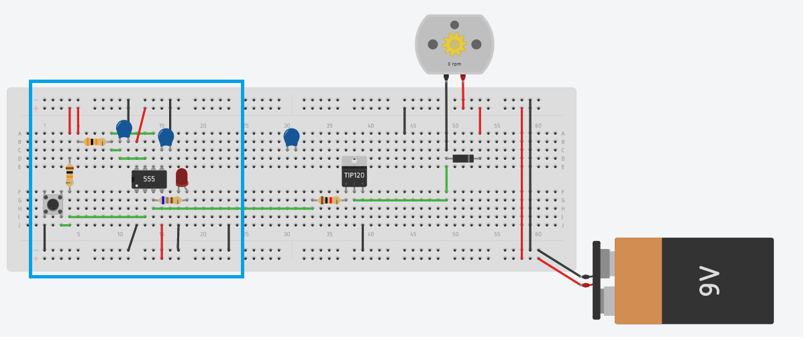
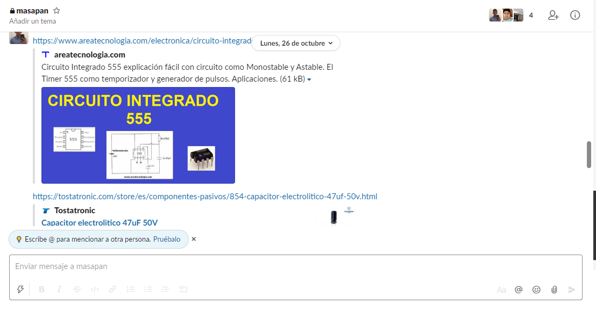
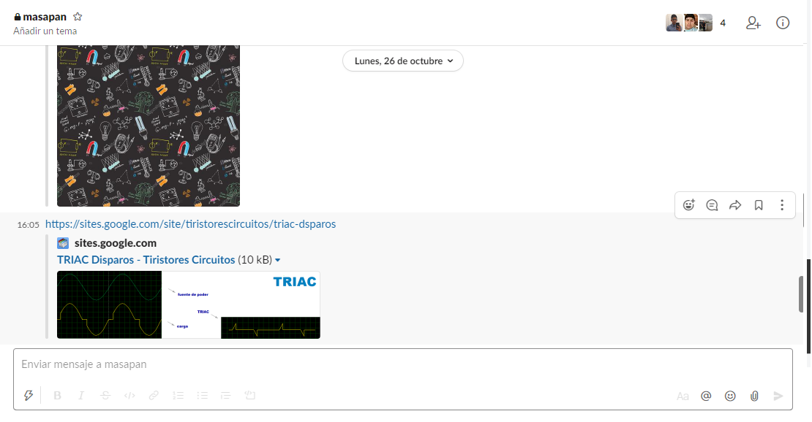

# Actuadores

# :trophy: A.2.2 Actividad de aprendizaje

 Realizar un sistema de control de arranque y encendido para un actuador eléctrico a través de un circuito electrónico, utilizando un simulador, un **Temporizador NE55s** y un **Motor de DC**.


### :blue_book: Instrucciones

- Se sugiere para el desarrollado de la presenta actividad, utilice uno de los siguientes simuladores: [Autodesk Tinkercad](https://www.tinkercad.com/), [Virtual BreadBoard](http://www.virtualbreadboard.com/), [Easy EDA](https://easyeda.com/) por lo cual habrá que familiarizarse antes, e incluso instalarse o registrarse dentro de la plataforma.
- Toda actividad o reto se deberá realizar utilizando el estilo **MarkDown con extension .md** y el entorno de desarrollo VSCode, debiendo ser elaborado como un documento **single page**, es decir si el documento cuanta con imágenes, enlaces o cualquier documento externo debe ser accedido desde etiquetas y enlaces, y debe ser nombrado con la nomenclatura **A2.2_NombreApellido_Equipo.pdf.**
- Es requisito que el .md contenga una etiqueta del enlace al repositorio de su documento en GITHUB, por ejemplo **Enlace a mi GitHub** y al concluir el reto se deberá subir a github.
- Desde el archivo **.md** exporte un archivo **.pdf** que deberá subirse a classroom dentro de su apartado correspondiente, sirviendo como evidencia de su entrega, ya que siendo la plataforma **oficial** aquí se recibirá la calificación de su actividad.
- Considerando que el archivo .PDF, el cual fue obtenido desde archivo .MD, ambos deben ser idénticos.
- Su repositorio ademas de que debe contar con un archivo **readme**.md dentro de su directorio raíz, con la información como datos del estudiante, equipo de trabajo, materia, carrera, datos del asesor, e incluso logotipo o imágenes, debe tener un apartado de contenidos o indice, los cuales realmente son ligas o **enlaces a sus documentos .md**, _evite utilizar texto_ para indicar enlaces internos o externo.
- Se propone una estructura tal como esta indicada abajo, sin embargo puede utilizarse cualquier otra que le apoye para organizar su repositorio.
  
```
- readme.md
  - blog
    - C2.1_x.md
    - C2.2_x.md
  - img
  - docs
    - A2.1_x.md
    - A2.2_x.md
```
### :pencil2: Desarrollo

1. Utilice el siguiente listado de materiales para la elaboración de la actividad

   | Cantidad | Descripción                            | Fuente |
   | -------- | -------------------------------------- |--------|
   | 1        | Circuito integrado LM555               |[Areatecnologia.com](https://www.areatecnologia.com/electronica/circuito-integrado-555.html)|
   | 1        | Capacitor electrolítico de 47uf        |[Tostatronic.com](https://tostatronic.com/store/es/componentes-pasivos/854-capacitor-electrolitico-47uf-50v.html)|
   | 1        | Condensador cerámico de 10nf           |[Geekbotelectronics.com](http://www.geekbotelectronics.com/producto/capacitor-ceramico-10-nf-50-v/)|
   | 1        | Fuente de voltaje de 9V                |[Cdmxelectronica.com](https://cdmxelectronica.com/producto/fuente-de-alimentacion-9v-1a-para-arduino/)|
   | 1        | Transistor de poder TIP122             |[Sandorobotics.com](https://sandorobotics.com/producto/tip122/)|
   | 1        | Diodo 1N4001 o equivalente             |[330ohms.com](https://www.330ohms.com/products/diodo-rectificador-1n4001)|
   | 1        | Mini Motor DC                          |[Electrocomponentes.es](https://www.electrocomponentes.es/motores/mini-motor-dc-3v-5v-6v-tipo-130-diy-smart-car-565-.html)|
   | 3        | Resistencias 680,1k,10k Ohmios de 1/4w |[Fisic.ch](https://www.fisic.ch/contenidos/electricidad/ley-de-ohm-y-resistencia/)|
   | 1        | Pulsador de disparo                    |[Sites.google.com](https://sites.google.com/site/tiristorescircuitos/triac-dsparos)|
   | 1        | Diodo Led Rojo                         |[Geekbotelectronics.com](http://www.geekbotelectronics.com/producto/led-difuso-rojo-5-mm/)|


2. Utilice el circuito electrónico de la imagen siguiente y ensamble la etapa 1 dentro del simulador.

   <p align="center">
       
   </p>


3. Como se podrá observar en el circuito anterior existe un area identificada como "Red de tiempo" y otra "Filtro de desacople", **explique el proposito de ambos terminologias**.

    La red de tiempo es el cojunto de elementos que se encargara de determinar cuanto es el tiempo de duracion del encendido del pulso de salida, dependiendo de lo que se quiera.

    El filtro de desacople se encarga de limpiar el ruido de la señal que va de salida, para que esta llegue lo más limpia y precisa posible a la siguiente parte del circuito.

4. Continuando con la imagen anterior, observe se muestra la ecuación Ct= 1.1 * R1 * C1, la cual es utilizada para establecer el tiempo de **encendido del pulso de salida**. Basándose en esa ecuación anterior calcule los valores de **R1 y C1** si se desea mantener encendido el pulso de salida, dada las 3 condiciones requeridas en la tabla anexa.

    | Numero | Condición  | Valor de R1 | Valor de C1 |
    | ------ | ---------- | ----------- | ----------- |
    | 1      | 3 segundos |    18KΩ     |   152μF     |
    | 2      | 5 segundos |    18KΩ     |   253μF     |
    | 3      | 8 segundos |    30KΩ     |   243μF     |

    **Para 3 segundos:**

     R1 = 18KΩ 
     C1 = 152μF
     Ct = 1.1 * (18000) * (0.000152) = 3.009 seg

    **Para 5 segundos**

     R1 = 18KΩ 
     C1 = 253μF
     Ct= 1.1 * (18000) * (0.000253) = 5.009 seg

    **Para 8 segundos**

     R1 = 30KΩ 
     C1 = 243μF
     Ct= 1.1 * (30000) * (0.000243) = 8.001 seg

5. Una vez que se halla completado la tabla anterior, inicie la simulación para cualquiera de las tres condiciones y observe el comportamiento del Led;  **explique su observación**.

     Como era de esperarse al utilizar los valores correctos en R1 y C1 el tiempo para cada una de las condiciones se cumple como debe, enciende al momento de presionar el botón y se apaga después de haber cumplido con el tiempo establecido.

6. Ensamble la etapa 2 e integre la terminal del pulso de salida a la entrada de la base del transistor de esta segunda etapa.

      <p align="center">
       
     </p>

7. Una vez concluido el paso anterior, elija una de las 3 condiciones registradas en la tabla anterior y observe el comportamiento del motor DC; **explique su observación**.

      El motor rc al igual que el led se comportan de la misma manera, es decir, el motor al momento de darle al botón comienza a girar, esto hasta que termina el tiempo estipulado y vuelve a las 0 rpm.

8. Una vez que el tiempo de encendido del pulso de salida de la etapa 1 se completo, **¿Qué sucede con el motor DC? Explique la razon de este comportamiento**

      El motor comienza a bajar sus rpm hasta llegar a 0 que es cuando se detiene, esto sucede porque la señal para que funcione se la da el led, entonces dura encendido lo que dure el led, una vez que se apaga el led entonces el motor deja de funcionar.

9. Conclusiones

   **Marquez Millan Seashell Vanessa**
   
Puedo decir como conclusión que este a sido uno de los trabajos que más me han costado en lo personal, fueron varios intentos, para ver que el error se encontraba en el acomodo de las patas de el pulsador, creo que de esta práctica me llevo mas conocimientos en cuestión de lectura de diagramas y el vermas visualmente como los cálculos que hacemos a mano con fórmulas se ven reflejados perfectamente en un ejemplo práctico, creo que hacerlo de esta manera hace que quede más claro el funcionamiento de dichos diagramas y sistemas eléctricos
   

   
   **Garcia Rosas Ivan**
  
   Una vez analizado el circuito anterior podemos ver que al tener un punto de activación como fue el led en este caso, puede funcionar como el "chispazo" para hacer que funcione el motor rc, esto podría verse el situaciones industriales, claro no con estos componentes pero si algo similar, o en situaciones más comunes como el tiempo de encendido de alguna maquina o algo por el estilo, todo esto controlado principalmente por el temporizador 555 que fue el protagonista en este circuito.


   **Pardo Cruz Jesús Ramón**
No estoy muy familiarizado con este chip el temporizador 555, que en esta actividad pues tuvo un gran papel en el circuito, ya que hace girar el motor por la cantidad de tiempo que se le imponga. Por mi parte en mi trabajo, en la estación de trabajo que tengo al lado tengo un Jig, de presion que funciona con cilíndros neumáticos, el punto de esto es qye funciona por tiempo al momento de tener la unidad dentro de el dura un periodo de tiempo haciendo presión y posteriormente lo libera, nose si funcione con este tipo de micrichip, pero el funcionamiento o la dinamica es casi la misma.

   ## Evidencias
   <p align="center">
       
     </p>
     <p align="center">
       
     </p>
     <p align="center">
       
     </p>

### :bomb: Rubrica

| Criterios     | Descripción                                                                                  | Puntaje |
| ------------- | -------------------------------------------------------------------------------------------- | ------- |
| Instrucciones | Se cumple con cada uno de los puntos indicados dentro del apartado Instrucciones?            | 10      |
| Desarrollo    | Se respondió a cada uno de los puntos solicitados dentro del desarrollo de la actividad?     | 60      |
| Demostración  | El alumno se presenta durante la explicación de la funcionalidad de la actividad?            | 20      |
| Conclusiones  | Se incluye una opinión personal de la actividad  por cada uno de los integrantes del equipo? | 10      |


:house: [Ir a GitHub - Marquez Millan Seashell Vanessa](https://github.com/seashelltec/SistemasProgramables)

:house: [Ir a GitHub - Garcia Rosas Ivan](https://github.com/GarciaRosasIvan/GarciaRosasIvan_SistemasProgramables/blob/master/README.md)

:house: [Ir a GitHub - Pardo Cruz Jesús Ramón](https://github.com/RamonPardo1580/SistemasProgramables-blog)
