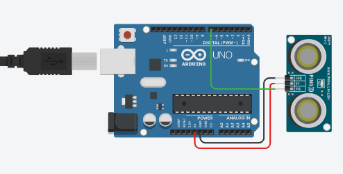
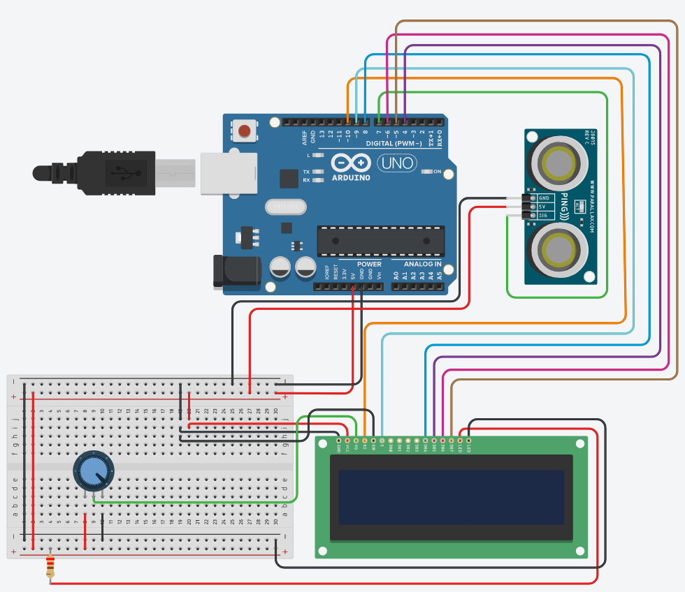
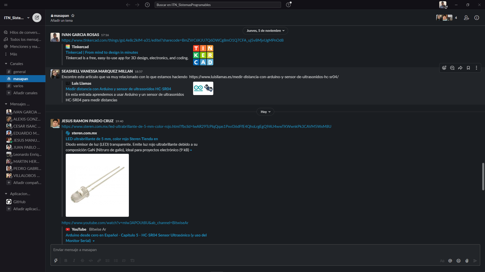
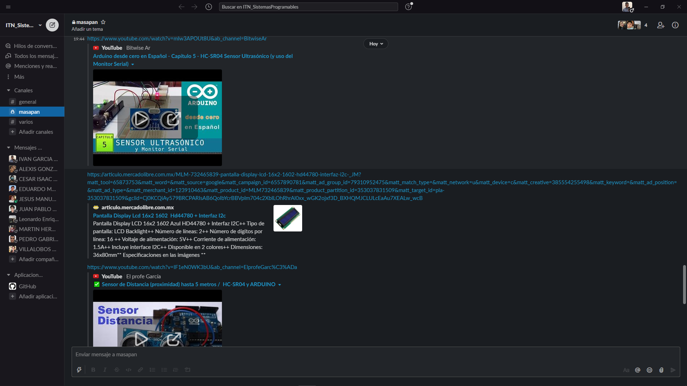
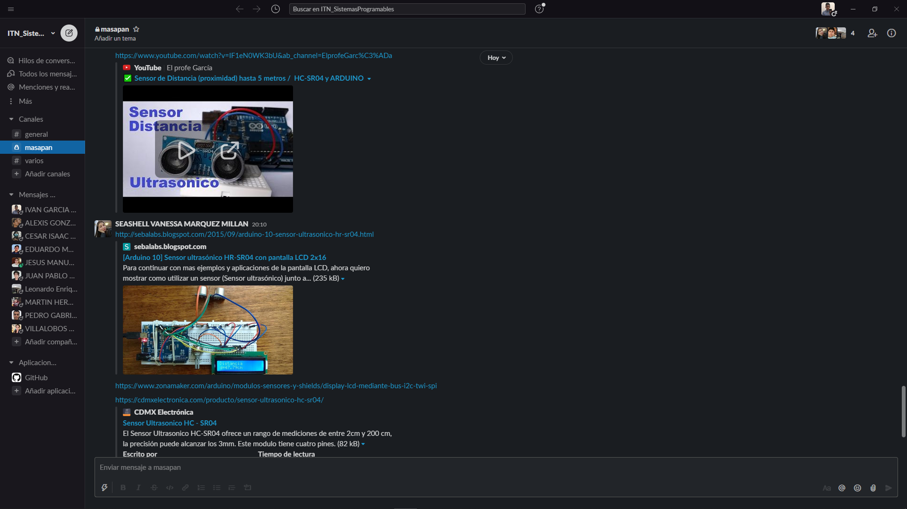
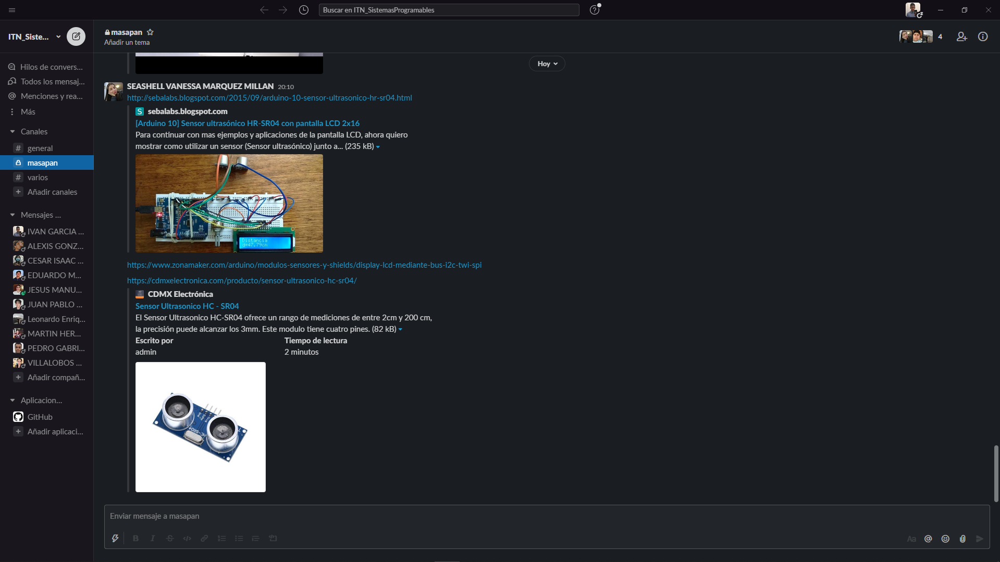

# :trophy: A.3.1 Actividad de aprendizaje

Circuito sensor de detección de objetos, utilizando un Arduino, un sensor ultrasonico y un Display I2C LCD 16x2.
___

## Instrucciones

- Realizar un sistema simulado, capaz de detectar la presencia y/o ausencia de un objeto, a través de un circuito electrónico, utilizando un Arduino, y un **Sensor Ultrasonico HC-SR04**.
- Toda actividad o reto se deberá realizar utilizando el estilo **MarkDown con extension .md** y el entorno de desarrollo VSCode, debiendo ser elaborado como un documento **single page**, es decir si el documento cuanta con imágenes, enlaces o cualquier documento externo debe ser accedido desde etiquetas y enlaces, y debe ser nombrado con la nomenclatura **A3.1_NombreApellido_Equipo.pdf.**
- Es requisito que el .md contenga una etiqueta del enlace al repositorio de su documento en GITHUB, por ejemplo **Enlace a mi GitHub** y al concluir el reto se deberá subir a github.
- Desde el archivo **.md** exporte un archivo **.pdf** que deberá subirse a classroom dentro de su apartado correspondiente, sirviendo como evidencia de su entrega, ya que siendo la plataforma **oficial** aquí se recibirá la calificación de su actividad.
- Considerando que el archivo .PDF, el cual fue obtenido desde archivo .MD, ambos deben ser idénticos.
- Su repositorio ademas de que debe contar con un archivo **readme**.md dentro de su directorio raíz, con la información como datos del estudiante, equipo de trabajo, materia, carrera, datos del asesor, e incluso logotipo o imágenes, debe tener un apartado de contenidos o indice, los cuales realmente son ligas o **enlaces a sus documentos .md**, _evite utilizar texto_ para indicar enlaces internos o externo.
- Se propone una estructura tal como esta indicada abajo, sin embargo puede utilizarse cualquier otra que le apoye para organizar su repositorio.
  
```
- readme.md
  - blog
    - C3.1_TituloActividad.md
    - C3.2_TituloActividad.md
    - C3.3_TituloActividad.md
    - C3.4_TituloActividad.md
    - C3.5_TituloActividad.md
    - C3.6_TituloActividad.md
    - C3.7_TituloActividad.md
    - C3.8_TituloActividad.md
  - img
  - docs
    - A3.1_TituloActividad.md
    - A3.2_TituloActividad.md
    - A3.3_TituloActividad.md
```
___

## Desarrollo

1.Utilizar el siguiente listado de materiales para la elaboración de la actividad

| Cantidad | Descripción                                                                                                                                                                                                                        |
| -------- | ---------------------------------------------------------------------------------------------------------------------------------------------------------------------------------------------------------------------------------- |
| 1        | Sensor [Ultrasonico HC-SR04](https://www.amazon.com.mx/SainSmart-HC-SR04-Ranging-Detector-Distance/dp/B004U8TOE6/ref=sr_1_5?__mk_es_MX=%C3%85M%C3%85%C5%BD%C3%95%C3%91&dchild=1&keywords=hc-sr04&qid=1599005012&sr=8-5)            |
| 2        | Resistencia de 1.2k                                                                                                                                                                                                                |
| 1        | Diodo led Rojo                                                                                                                                                                                                                     |
| 1        | Fuente de voltaje de 5V                                                                                                                                                                                                            |
| 1        | [1 Potenciómetro 10k ](https://www.amazon.com.mx/Uxcell-a15011600ux0235-Linear-Rotary-Potentiometer/dp/B01DKCUVMQ/ref=sr_1_1?__mk_es_MX=%C3%85M%C3%85%C5%BD%C3%95%C3%91&dchild=1&keywords=potenciometro+10k&qid=1599005041&sr=8-1) |
| 1        | [Arduino UNO](https://www.amazon.com.mx/Progressive-Automations-LC-066-Arduino-Rev3/dp/B00WH5XOJK/ref=sr_1_7?__mk_es_MX=%C3%85M%C3%85%C5%BD%C3%95%C3%91&dchild=1&keywords=arduino+uno&qid=1599005073&sr=8-7)                       |

1. Basado en la imágen que se muestra, ensamble dentro del simulador a utilizar, el circuito electrónico indicado en la **Figura 1**.

     <p align="center">
     
     </p>
     <p align="center"> <b>Figura 1 Sensor Ultrasonico</b> </p>

2. Realice el programa que permita a través de una de las entradas del Arduino, recibir el valor que registra el **Sensor Ultrasonico** al acercarse un objeto a distintas distancias.

```
// Esta constante no cambia. Es el pin que corresponde a la salida del sensor
const int pingPin = 7;

void setup() {
  // Inicializa la comunicacion serial a 9600 bits por segundo:
  Serial.begin(9600);
}

void loop() {

  // Establece variables para la duracion de ping, y la distancia resultante en cm:
  long duration, cm;

  // El PING))) es activado por un pulso HIGH de 2 o mas microsegundos.
  // Da un pulso LOW corto antes de dar el HIGH para dar el pulso HIGH limpio:
  pinMode(pingPin, OUTPUT);
  digitalWrite(pingPin, LOW);
  delayMicroseconds(2);
  digitalWrite(pingPin, HIGH);
  delayMicroseconds(5);
  digitalWrite(pingPin, LOW);

  // El mismo pin es usado para leer la señal de PING))): un pulso HIGH donde la duracion 
  // es el tiempo en microsegundos desde el envio de la señal hasta la recepcion del eco 
  // cuando toque un objeto
  pinMode(pingPin, INPUT);
  duration = pulseIn(pingPin, HIGH);

  // Convierte el tiempo a distancia
   
  // La velocidad del sonido es de 340 m/s o 29 microsegundos por centimettro.
  // El ping viaja ida y vuelta, entonces para encontrar la distancia a la que tenemos el 
  // objeto tomamos la mitad de la distancia viajada.
  cm = duration / 29 / 2;;
  
  Serial.print(cm);
  Serial.print("cm");
  Serial.println();

  delay(100); 
}
```

3. Considerando que el sensor ultrasonico tiene un rango mínimo y máximo de detección basado en el tiempo de retorno de la señal sonica, que valores se obtienen en la simulación bajo las **siguientes condiciones:**

| Número | Condición 1                   | Condición 2                                | ¿El objeto es detectado? |
| ------ | ----------------------------- | ------------------------------------------ | -------------------------|
| 1      | 5 cm de distancia al sensor   | 0 grados al eje perpendicular del sensor   |            Si
| 2      | 50 cm de distancia al sensor  | 35 grados al eje perpendicular del sensor  |            Si
| 3      | 100 cm de distancia al sensor | -35 grados al eje perpendicular del sensor |            Si
| 4      | 5 cm de distancia al sensor   | 90 grados al eje perpendicular del sensor  |            No
| 5      | 50 cm de distancia al sensor  | -60 grados al eje perpendicular del sensor |            Si
| 6      | 350 cm de distancia al sensor | 0 grados al eje perpendicular del sensor   |            No

4. Una vez completados los puntos anteriores, agregue a la Figura 1, **un Display I2C 16x2 LCD**, y coloque la imagen del circuito completado hasta este apartado.

     <p align="center">
     
     </p>

5. Al haber completado la integración del Display I2C, ajuste el programa que le permita a través del display mostrar el siguiente mensaje, **"Objetivo detectado a ? cm** , y en caso de no lograr la detección indicar el mensaje **"Objetivo fuera de rango"**

```
// Incluye la libreria de la pantalla
#include <LiquidCrystal.h> 

// Esta constante no cambia. Es el pin que corresponde a la salida del sensor
const int pingPin = 7;

//Coloca los parametros: (rs, enable, d4, d5, d6, d7)
const int rs = 10, en = 9, d4 = 8, d5 = 4, d6 = 6, d7 = 5;
LiquidCrystal lcd(rs, en, d4, d5, d6, d7);


void setup() {
  // Inicializa la comunicacion serial a 9600 bits por segundo:
  Serial.begin(9600);
  //
  lcd.begin(16,2);
}

void loop() {

  // Establece variables para la duracion de ping, y la distancia resultante en cm
  long duration, cm;

  // El PING))) es activado por un pulso HIGH de 2 o mas microsegundos.
  // Da un pulso LOW corto antes de dar el HIGH para dar el pulso HIGH limpio:
  pinMode(pingPin, OUTPUT);
  digitalWrite(pingPin, LOW);
  delayMicroseconds(2);
  digitalWrite(pingPin, HIGH);
  delayMicroseconds(5);
  digitalWrite(pingPin, LOW);

  // El mismo pin es usado para leer la señal de PING))): un pulso HIGH donde la duracion 
  // es el tiempo en microsegundos desde el envio de la señal hasta la recepcion del eco 
  // cuando toque un objeto
  pinMode(pingPin, INPUT);
  duration = pulseIn(pingPin, HIGH);

  // Convierte el tiempo a distancia
   
  // La velocidad del sonido es de 340 m/s o 29 microsegundos por centimettro.
  // El ping viaja ida y vuelta, entonces para encontrar la distancia a la que tenemos el 
  // objeto tomamos la mitad de la distancia viajada.
  cm = duration / 29 / 2;;
  
  Serial.print(cm);
  Serial.print("cm");
  Serial.println();

  delay(100);
  
  
  //Condiciion en caso de que este fuera de rango
  if(cm == 336) {
    
    lcd.setCursor(0, 0);
    lcd.print("No detectado");
    lcd.setCursor(0, 1);
    lcd.print("                                 ");
  }
  else{
  
    // Seccion del LCD
    lcd.setCursor(0, 0);
    lcd.print("Detectado a: ");
    lcd.setCursor(0, 1);
    lcd.print(cm);
    lcd.print("cm");
    lcd.print(" ");
  
  }
  
}
```

6. Coloque aqui evidencias que considere importantes durante el desarrollo de la actividad.
   
     <p align="center">
     
     </p>

     <p align="center">
     
     </p>
     
     <p align="center">
     
     </p>
     
     <p align="center">
     
     </p>

7. Conclusiones

   **Marquez Millan Seashell Vanessa**

   Esta práctica creo que ha sido una de las más funcionales a nivel real es decir me empecé a dar cuenta que en las tiendas pequeñas tienen este tipo de sensores y lo que hace es indicar si entra una persona o no, esta práctica fue básicamente en lo que se basó, solo que la salida de él es diferente dado a que la forma de ver como sale la información ose la damos al usuario es diferente de dar, la verdad personalmente me ha costado siempre la parte de los displays como el que usamos en la práctica o más pequeños que solo son para números, ya que la forma de conexión es un poco enredoso o a mí se me complica un poco, lo bueno es que encontramos buena información junto con mis compañeros y resulto más sencillo.

   
   **Garcia Rosas Ivan**
   
   En realidad, la programación del sensor, así como de la pantalla noes complicada ya que Arduino te facilita un poco esa parte, y si hablamos más enfocados a la pantalla hay una Liberia que nos deja manejar mucho más fácil el componente, en cuanto al sensor ultrasónico actúa de manera eficiente y con precisión, dando oportunidad a usos útiles como puede ser en un sensor de parquímetro.
   


   **Pardo Cruz Jesús Ramón**

   El protagonista de esta práctica como lo podemos ver es el sensor ultrasónico  HC-SR04, el cual se usa frecuentemente para la detección de obstáculos, en esta práctica su propósito fue el medir la distancia de un objetó en el simulador, programado en el micro controlador arduino uno, imprimiendo el mensaje del rango del objeto, si este no es detectado dentro de su rango en una pantalla LCD de 16x2, igualmente programado el mensaje en arduino uno.

___

### :bomb: Rubrica

| Criterios     | Descripción                                                                                  | Puntaje |
| ------------- | -------------------------------------------------------------------------------------------- | ------- |
| Instrucciones | Se cumple con cada uno de los puntos indicados dentro del apartado Instrucciones?            | 10      |
| Desarrollo    | Se respondió a cada uno de los puntos solicitados dentro del desarrollo de la actividad?     | 60      |
| Demostración  | El alumno se presenta durante la explicación de la funcionalidad de la actividad?            | 20      |
| Conclusiones  | Se incluye una opinión personal de la actividad  por cada uno de los integrantes del equipo? | 10      |

:house: [Ir a GitHub - Marquez Millan Seashell Vanessa](https://github.com/seashelltec/SistemasProgramables)

:house: [Ir a GitHub - Garcia Rosas Ivan](https://github.com/GarciaRosasIvan/GarciaRosasIvan_SistemasProgramables/blob/master/README.md)

:house: [Ir a GitHub - Pardo Cruz Jesús Ramón](https://github.com/RamonPardo1580/SistemasProgramables-blog)

