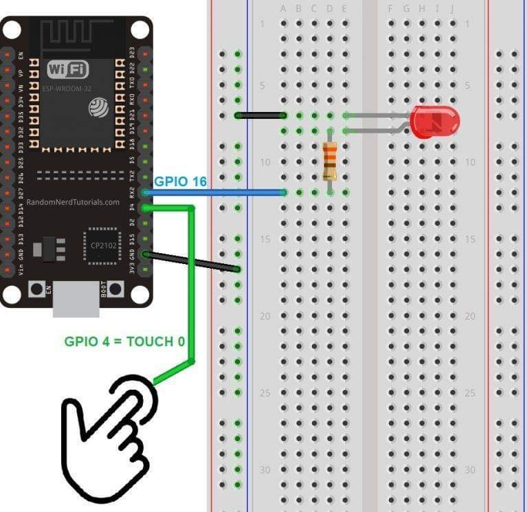
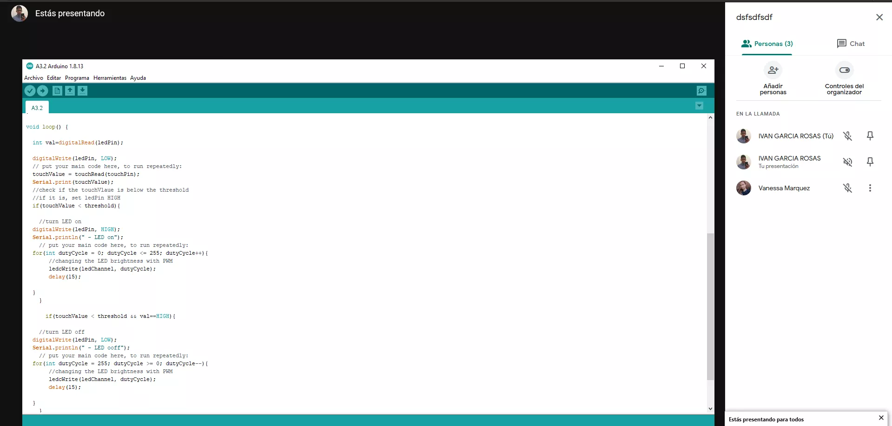
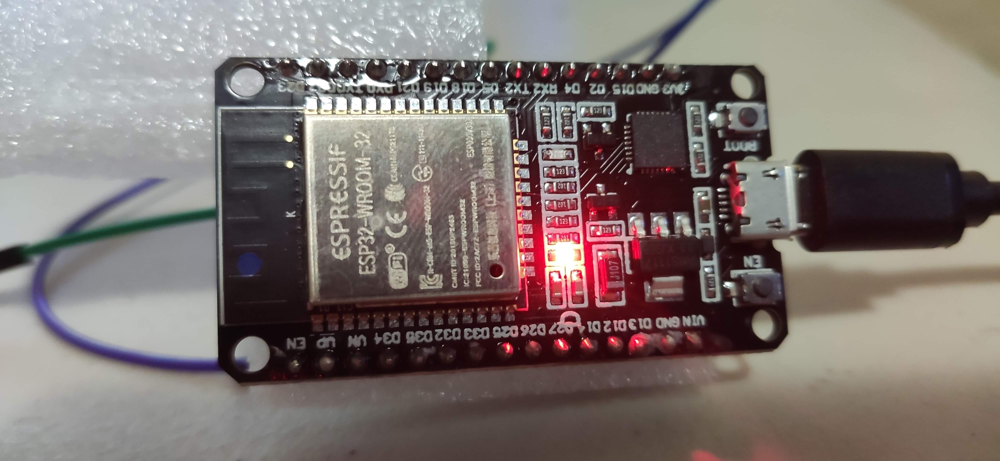
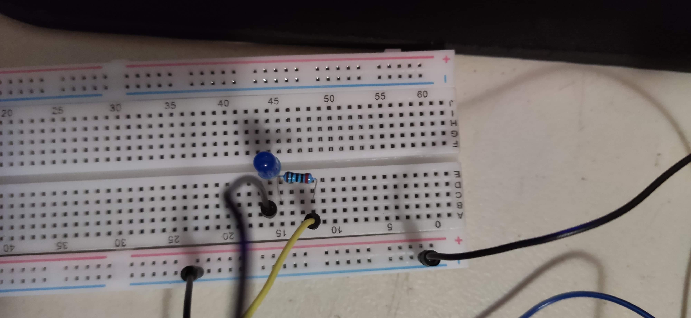

# :trophy: A.3.2 Actividad de aprendizaje

Circuito sensor de tacto a través de un NodeMCU ESP32
___

## Instrucciones

- Basado en la figura 1, ensamblar un sistema, capaz de responder al tacto, a través de un circuito electrónico, utilizando un NodeMCU **ESP32**, un  **Sensor de tacto capacitivo**.
- Toda actividad o reto se deberá realizar utilizando el estilo **MarkDown con extension .md** y el entorno de desarrollo VSCode, debiendo ser elaborado como un documento **single page**, es decir si el documento cuanta con imágenes, enlaces o cualquier documento externo debe ser accedido desde etiquetas y enlaces, y debe ser nombrado con la nomenclatura **A3.2_NombreApellido_Equipo.pdf.**
- Es requisito que el .md contenga una etiqueta del enlace al repositorio de su documento en GITHUB, por ejemplo **Enlace a mi GitHub** y al concluir el reto se deberá subir a github.
- Desde el archivo **.md** exporte un archivo **.pdf** que deberá subirse a classroom dentro de su apartado correspondiente, sirviendo como evidencia de su entrega, ya que siendo la plataforma **oficial** aquí se recibirá la calificación de su actividad.
- Considerando que el archivo .PDF, el cual fue obtenido desde archivo .MD, ambos deben ser idénticos.
- Su repositorio ademas de que debe contar con un archivo **readme**.md dentro de su directorio raíz, con la información como datos del estudiante, equipo de trabajo, materia, carrera, datos del asesor, e incluso logotipo o imágenes, debe tener un apartado de contenidos o indice, los cuales realmente son ligas o **enlaces a sus documentos .md**, _evite utilizar texto_ para indicar enlaces internos o externo.
- Se propone una estructura tal como esta indicada abajo, sin embargo puede utilizarse cualquier otra que le apoye para organizar su repositorio.
  
```
- readme.md
  - blog
    - C3.1_TituloActividad.md
    - C3.2_TituloActividad.md
    - C3.3_TituloActividad.md
    - C3.4_TituloActividad.md
    - C3.5_TituloActividad.md
    - C3.6_TituloActividad.md
    - C3.7_TituloActividad.md
    - C3.8_TituloActividad.md
  - img
  - docs
    - A3.1_TituloActividad.md
    - A3.2_TituloActividad.md
    - A3.3_TituloActividad.md
```
___

### Fuentes de apoyo para desarrollar la actividad

- [x] [Sensor de tacto capacitivo](https://randomnerdtutorials.com/esp32-touch-pins-arduino-ide/)
- [x] [Salida analogica PWM](https://randomnerdtutorials.com/esp32-pwm-arduino-ide/)

___

## Desarrollo

1.Utilice el siguiente listado de materiales para la elaboración de la actividad

| Cantidad | Descripción                                                                                                                                                                                                                |
| -------- | -------------------------------------------------------------------------------------------------------------------------------------------------------------------------------------------------------------------------- |
| 1        | Diodo led Rojo                                                                                                                                                                                                             |
| 1        | Resistencia 330 ohms                                                                                                                                                                                                       |
| 1        | Fuente de voltaje de 5V                                                                                                                                                                                                    |
| 1        | [NodeMCU ESP32](https://www.amazon.com.mx/ESP-32-ESP-32S-ESP-WROOM-32-ESP32-S-desarrollo/dp/B07TBFC75Z/ref=sr_1_2?__mk_es_MX=%C3%85M%C3%85%C5%BD%C3%95%C3%91&dchild=1&keywords=esp32&qid=1599003438&sr=8-2)                |
| 1        | [BreadBoard](https://www.amazon.com.mx/Deke-Home-Breadboard-distribuci%C3%B3n-electr%C3%B3nica/dp/B086C9HK7V/ref=sr_1_22?__mk_es_MX=%C3%85M%C3%85%C5%BD%C3%95%C3%91&dchild=1&keywords=breadboard&qid=1599003455&sr=8-22)   |
| 1        | [Jumpers M/M](https://www.amazon.com.mx/ELEGOO-Macho-Hembra-Macho-Macho-Hembra-Hembra-Protoboard/dp/B06ZXSQ5WG/ref=sr_1_1?__mk_es_MX=%C3%85M%C3%85%C5%BD%C3%95%C3%91&dchild=1&keywords=jumper+wires&qid=1599003519&sr=8-1) |
| 1        | Hoja de aluminio                                                                                                                                        
<p align="center"> 
    <strong>Figura 1 Circuito ESP32 IC L293 Motor DC</strong>
    
</p>

1. Una vez ensamblado el circuito anterior, realice un programa que permita al ensamble cumplir con las siguientes condiciones:
    - El sistema deberá ser capaz de encender y apagar **un led** al presionar el sensor de tacto.
    - El sistema deberá tener la característica que si el Led esta encendido, al tocar el sensor de tacto, este iniciara un secuencia de intermitencia de 3 segundos (es decir se apaga 1 segundo, se enciende un segundo y se apaga finalmente).
    - El sistema deberá contar con la característica que si el Led esta apagado, al tocar el sensor de tacto, este se encenderá poco a poco hasta llegar a su nivel máximo de iluminación.
2. Coloque aquí evidencias que considere importantes durante el desarrollo de la actividad.

      <p align="center">
       
      </p>

      <p align="center">
       
      </p>

      <p align="center">
       
      </p>

```
//set pin numbers
const int touchPin = 4;
const int ledPin = 16;

//change with your threshold value
const int threshold = 20;
//variable for storing the touch pin value
int touchValue;

//setting PWM properties
const int freq = 5000;
const int ledChannel = 0;
const int resolution = 8;


void setup() {
  // put your setup code here, to run once:
  Serial.begin(9600);
  delay(1000); //give me time to bring up serial monitor
  //initialize the LED pin as an output
  pinMode(ledPin, OUTPUT);

    // put your setup code here, to run once:
  ledcSetup(ledChannel, freq, resolution);

  //attach the channel to the GPIO to be controlled
  ledcAttachPin(ledPin, ledChannel);
}

void loop() {
  
  int val=digitalRead(ledPin);
  
  digitalWrite(ledPin, LOW);
  // put your main code here, to run repeatedly:
  touchValue = touchRead(touchPin);
  Serial.print(touchValue);
  //check if the touchVlaue is below the threshold
  //if it is, set ledPin HIGH
  if(touchValue < threshold){
   
    //turn LED on
  digitalWrite(ledPin, HIGH);
  Serial.println(" - LED on");
    // put your main code here, to run repeatedly:
  for(int dutyCycle = 0; dutyCycle <= 255; dutyCycle++){
       //changing the LED brightness with PWM
       ledcWrite(ledChannel, dutyCycle);
       delay(15);
      
  }
    }
   
      if(touchValue < threshold && val==HIGH){
   
    //turn LED off
  digitalWrite(ledPin, LOW);
  Serial.println(" - LED ooff");
    // put your main code here, to run repeatedly:
  for(int dutyCycle = 255; dutyCycle >= 0; dutyCycle--){
       //changing the LED brightness with PWM
       ledcWrite(ledChannel, dutyCycle);
       delay(15);
      
  }
    }
    


    delay(1000);
}
```

1. Conclusiones

   **Marquez Millan Seashell Vanessa**
    
    Como conclusión de esta práctica podemos decir que la parte que más me quedo fue la del pin touch ya que tenía la impresión que era más como un sensor, al saber que igual se puede usar con el papel aluminio que da la opción me hizo pensar acerca de cómo es que funciona mi teléfono con su touch, en cuestión de la programación, fue algo que me parece muy similar a lo que hemos estado haciendo, pero también en cuestión de cómo hacer que prendiera poco a poco y que hiciera la intermitencia el pensar un poco de cómo hacer esa parte.
   
   **Garcia Rosas Ivan**
   
    Al principio resultó un poco tedioso el desarrollo del código, ya que el circuito era bastante sencillo, después de investigar en diversas fuentes se encontró lo necesario para poder entender la función de cada apartado o línea de código. En realidad, el uso de este sensor touch podría usarse en diferentes cosas como algún tipo de seguridad, claro esta que con un código mucho mas desarrollado si se quiere implementar como un método de seguridad, pero los usos podrían ser varios, dependiendo de la creatividad y situación.

:video_camera: [Ir a la demostración en video](https://youtu.be/DhqMhi6xIE0)
___

### :bomb: Rubrica

| Criterios     | Descripción                                                                                  | Puntaje |
| ------------- | -------------------------------------------------------------------------------------------- | ------- |
| Instrucciones | Se cumple con cada uno de los puntos indicados dentro del apartado Instrucciones?            | 10      |
| Desarrollo    | Se respondió a cada uno de los puntos solicitados dentro del desarrollo de la actividad?     | 60      |
| Demostración  | El alumno se presenta durante la explicación de la funcionalidad de la actividad?            | 20      |
| Conclusiones  | Se incluye una opinión personal de la actividad  por cada uno de los integrantes del equipo? | 10      |

:house: [Ir a GitHub - Marquez Millan Seashell Vanessa](https://github.com/seashelltec/SistemasProgramables)

:house: [Ir a GitHub - Garcia Rosas Ivan](https://github.com/GarciaRosasIvan/GarciaRosasIvan_SistemasProgramables/blob/master/README.md)
