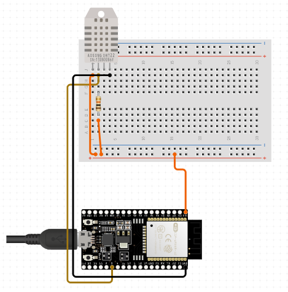
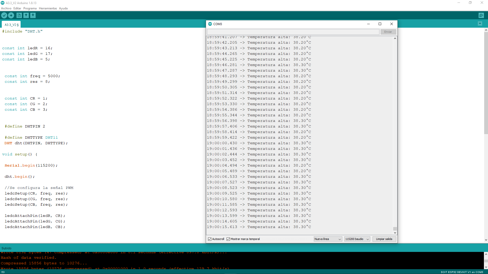
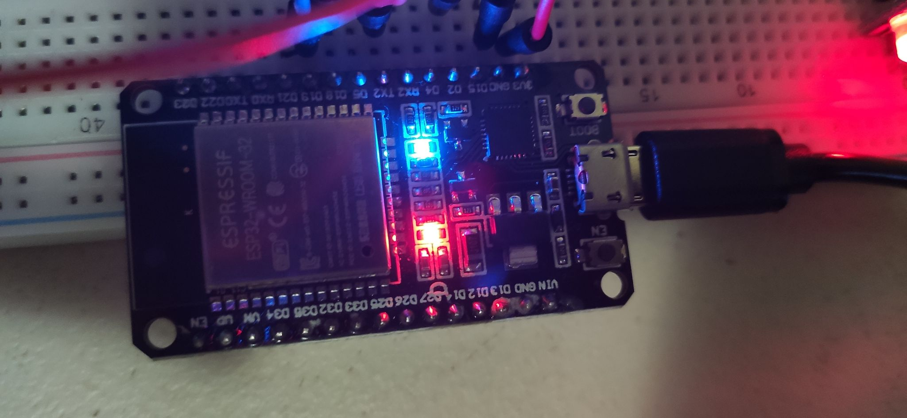
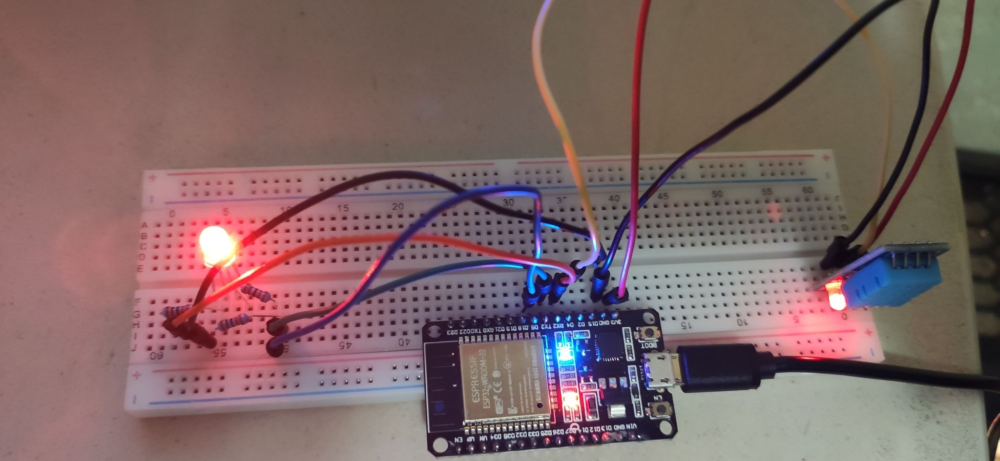
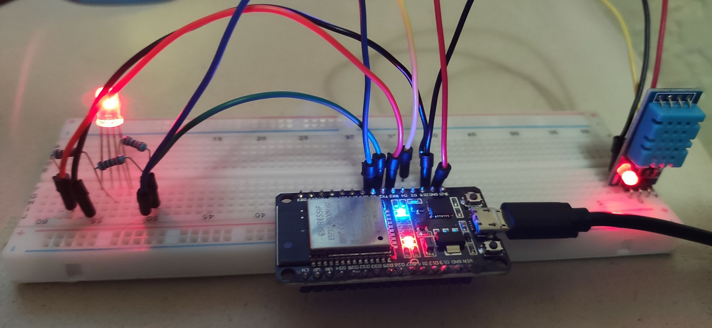
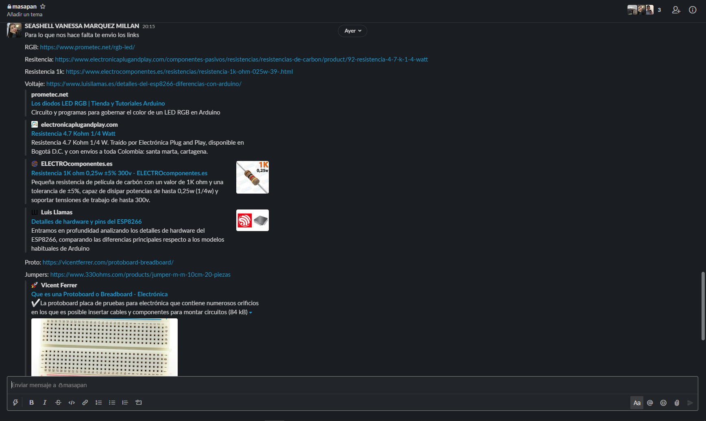
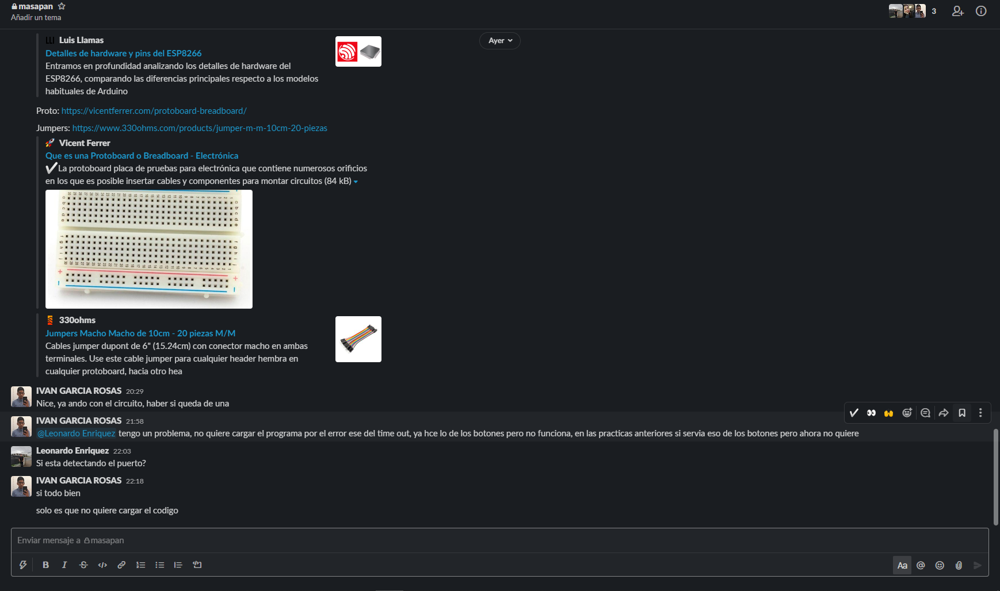

# :trophy: A.3.3 Actividad de aprendizaje

Circuito de medición de temperatura a través de un NodeMCU ESP32
___

## Instrucciones

- Basado en la figura 1, ensamblar un sistema, capaz de detectar la temperatura y humedad del ambiente, a través de un circuito electrónico, utilizando un NodeMCU **ESP32**, y un **Sensor DHT11/DHT22**.
- Toda actividad o reto se deberá realizar utilizando el estilo **MarkDown con extension .md** y el entorno de desarrollo VSCode, debiendo ser elaborado como un documento **single page**, es decir si el documento cuanta con imágenes, enlaces o cualquier documento externo debe ser accedido desde etiquetas y enlaces, y debe ser nombrado con la nomenclatura **A3.3_NombreApellido_Equipo.pdf.**
- Es requisito que el .md contenga una etiqueta del enlace al repositorio de su documento en GITHUB, por ejemplo **Enlace a mi GitHub** y al concluir el reto se deberá subir a github.
- Desde el archivo **.md** exporte un archivo **.pdf** que deberá subirse a classroom dentro de su apartado correspondiente, sirviendo como evidencia de su entrega, ya que siendo la plataforma **oficial** aquí se recibirá la calificación de su actividad.
- Considerando que el archivo .PDF, el cual fue obtenido desde archivo .MD, ambos deben ser idénticos.
- Su repositorio ademas de que debe contar con un archivo **readme**.md dentro de su directorio raíz, con la información como datos del estudiante, equipo de trabajo, materia, carrera, datos del asesor, e incluso logotipo o imágenes, debe tener un apartado de contenidos o indice, los cuales realmente son ligas o **enlaces a sus documentos .md**, _evite utilizar texto_ para indicar enlaces internos o externo.
- Se propone una estructura tal como esta indicada abajo, sin embargo puede utilizarse cualquier otra que le apoye para organizar su repositorio.
  
```
- readme.md
  - blog
    - C3.1_TituloActividad.md
    - C3.2_TituloActividad.md
    - C3.3_TituloActividad.md
    - C3.4_TituloActividad.md
    - C3.5_TituloActividad.md
    - C3.6_TituloActividad.md
    - C3.7_TituloActividad.md
    - C3.8_TituloActividad.md
  - img
  - docs
    - A3.1_TituloActividad.md
    - A3.2_TituloActividad.md
    - A3.3_TituloActividad.md
```

### Fuentes de apoyo para desarrollar la actividad:

   - [x] [Random Nerd Tutorial Touch pin](https://randomnerdtutorials.com/esp32-touch-pins-arduino-ide/)

   - [x] [Ejemplo de circuito con LED RGB Led](https://i0.wp.com/saber.patagoniatec.com/wp-content/uploads/2019/07/led-rgb-catodo-anado-comun.jpg)

___

## Desarrollo

1.Utilice el siguiente listado de materiales para la elaboración de la actividad

| Cantidad | Descripción                                                                                                                                                                                                                           |
| -------- | ------------------------------------------------------------------------------------------------------------------------------------------------------------------------------------------------------------------------------------- |
| 1        | [Sensor temperatura y humedad DHT11](https://articulo.mercadolibre.com.mx/MLM-664315278-sensor-de-temperatura-y-humedad-dht11-cjumpers-arduino-pic-_JM#position=1&type=item&tracking_id=b203e8cd-c375-429a-9b75-8c57e8b35386) o DHT22 |
| 1        | [Diodo led RG](https://www.prometec.net/rgb-led/)                                                                                                                                                                                                                         |
| 1        | [Resistencia 4.7 kohms](https://www.electronicaplugandplay.com/componentes-pasivos/resistencias/resistencias-de-carbon/product/92-resistencia-4-7-k-1-4-watt)                                                                                                                                                                                                                 |
| 3        | [Resistencias 1 kohm](https://www.electrocomponentes.es/resistencias/resistencia-1k-ohm-025w-39-.html)                                                                                                                                                                                                                    |
| 1        | [Fuente de voltaje de 5V](https://www.luisllamas.es/detalles-del-esp8266-diferencias-con-arduino/)                                                                                                                                                                                                               |
| 1        | [NodeMCU ESP32](https://articulo.mercadolibre.com.mx/MLM-587686290-esp32-wifi-bluetooth-42-ble-nodemcu-esp8266-libro-gratis-_JM#position=1&type=item&tracking_id=84a6234b-5016-47eb-9950-39b49846ca72)                                |
| 1        | [BreadBoard](https://vicentferrer.com/protoboard-breadboard/)                                                                                                                                                                                                                            |
| 1        | [Jumpers M/M](https://www.330ohms.com/products/jumper-m-m-10cm-20-piezas)                                                                                                                                                                                                                           |
       

1. Basado en las imágenes que se muestran en la **Figuras 1**, ensamble el circuito en un solo circuito electrónico, ide tal manera que se pueda obtener un sistema capaz de cumplir con las instrucciones antes solicitadas para esta actividad.
  

<p align="center"> 
    <strong>Figura 1 Circuito ESP32 y Sensor DHT</strong>
    
</p>

1.  Una vez ensamblado el circuito anterior, agregue un LED RGB y elabore el programa que le permita al LED RGB funcionar como indicador para las siguientes condiciones:
    - El sensor de temperatura en todo momento estará sensando, enviando el valor registrado por la terminal serial, por ejemplo "Temperatura ambiente: 25 grados" y el **LED RGB** estará encendido de color verde.
    - El sensor de temperatura al registrar un valor del ~20% por arriba de la temperatura ambiental, deberá mostrar el mensaje "Temperatura alta: ? grados" y el **LED RGB** se encenderá de color rojo.
    - El sensor de temperatura al registra un valor del ~20% por abajo de la temperatura ambiental, deberá mostrar el mensaje "Temperatura baja: ? grados" y el **LED RGB** se encenderá de color azul.
  - 
2. Coloque aquí evidencias que considere importantes durante el desarrollo de la actividad.

```c
#include "DHT.h" 


const int ledR = 16;
const int ledG = 17;
const int ledB = 5;


 const int freq = 5000;
 const int res = 8;


 const int CR = 1;
 const int CG = 2;
 const int CB = 3;


 #define DHTPIN 2

 #define DHTTYPE DHT11
 DHT dht(DHTPIN, DHTTYPE);
 
void setup() {

 Serial.begin(115200);

 dht.begin();
 
 //Se configura la señal PWM
 ledcSetup(CR, freq, res);
 ledcSetup(CG, freq, res);
 ledcSetup(CB, freq, res);

 ledcAttachPin(ledR, CR);
 ledcAttachPin(ledG, CG);
 ledcAttachPin(ledB, CB);
 

}

void loop() {

delay(1000);

float temp = dht.readTemperature();

if (temp >= 20 && temp <=30)
{
  Serial.print("Temperatura ambiente: ");
  ledcWrite(CR, 0);
  ledcWrite(CG, 256);
  ledcWrite(CB, 0);
  
}

if (temp < 20)
{
  Serial.print("Temperatura baja: ");
  ledcWrite(CR, 0);
  ledcWrite(CG, 0);
  ledcWrite(CB, 256);
  
}

if (temp > 30)
{
  Serial.print("Temperatura alta: ");
  ledcWrite(CR, 256);
  ledcWrite(CG, 0);
  ledcWrite(CB, 0);
  
}
//Imprimir los grados 
Serial.print(temp);
Serial.println("°C");
}

```

  <p align="center">
       
  </p>

  <p align="center">
       
  </p>

  <p align="center">
       
  </p>

  <p align="center">
       
  </p>

  <p align="center">
       
  </p>

  <p align="center">
       
  </p>


3. Conclusiones

   **Marquez Millan Seashell Vanessa**
    
    Como en todas las practicas vamos aprendiendo algo, creo que esta en especial, fue una que nos costó más que la mayoría por lo que siento que el aprendizaje fue mayor, ya que al intentar descubrir el problema que se tenía con el sensor y demás se llegaron a hacer muchas modificaciones e intentar nuevas cosas, como asegurarnos que el RGB fuera cátodo común y no ánodo, cambiar los valores manualmente, imaginar cómo bajar o subir la temperatura, nos deja mucho esta práctica.
   
   **Garcia Rosas Ivan**
   
    Como se pudo observar en el video y evidencias, tuvimos muchos problemas a la hora de utilizar el led rgb y el sensor dht11, pero después de mucho buscar dimos con algunas soluciones, mas no resulto todo, de igual manera se entiende el propósito de la actividad que es reflejar visualmente la temperatura a través de la consola y claro del led rgb cambiando su color dependiendo de la lectura, así como se usó para el led también podría usarse para estaciones y/o páginas web meteorológicas sencillas, ya que el sensor tiene su límite, y en cuanto al led las posibilidades de color son abiertas, pues podemos combinar colores para crear nuevos.

:video_camera: [Ir a la demostración en video](https://youtu.be/GR8Vho9t2TY)

___

### :bomb: Rubrica

| Criterios     | Descripción                                                                                  | Puntaje |
| ------------- | -------------------------------------------------------------------------------------------- | ------- |
| Instrucciones | Se cumple con cada uno de los puntos indicados dentro del apartado Instrucciones?            | 10      |
| Desarrollo    | Se respondió a cada uno de los puntos solicitados dentro del desarrollo de la actividad?     | 60      |
| Demostración  | El alumno se presenta durante la explicación de la funcionalidad de la actividad?            | 20      |
| Conclusiones  | Se incluye una opinión personal de la actividad  por cada uno de los integrantes del equipo? | 10      |

:house: [Ir a GitHub - Marquez Millan Seashell Vanessa](https://github.com/seashelltec/SistemasProgramables)

:house: [Ir a GitHub - Garcia Rosas Ivan](https://github.com/GarciaRosasIvan/GarciaRosasIvan_SistemasProgramables/blob/master/README.md)