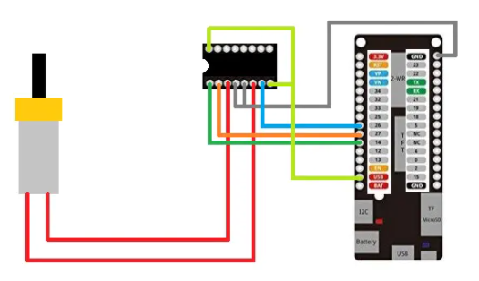
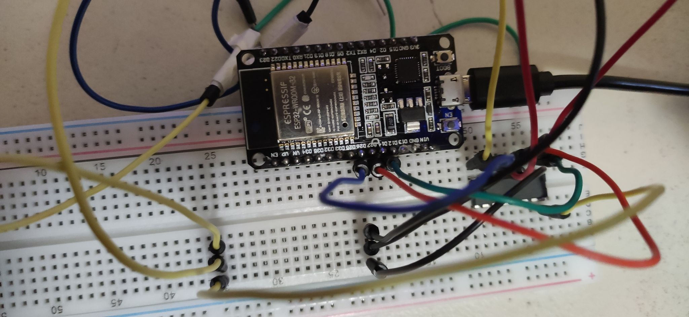
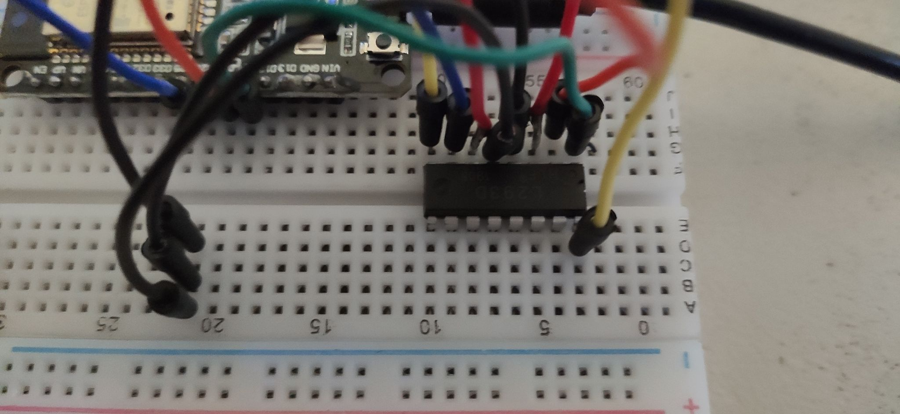
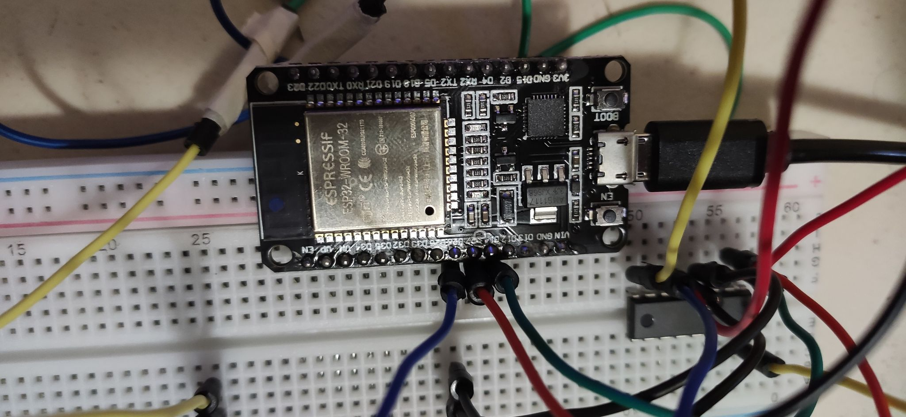
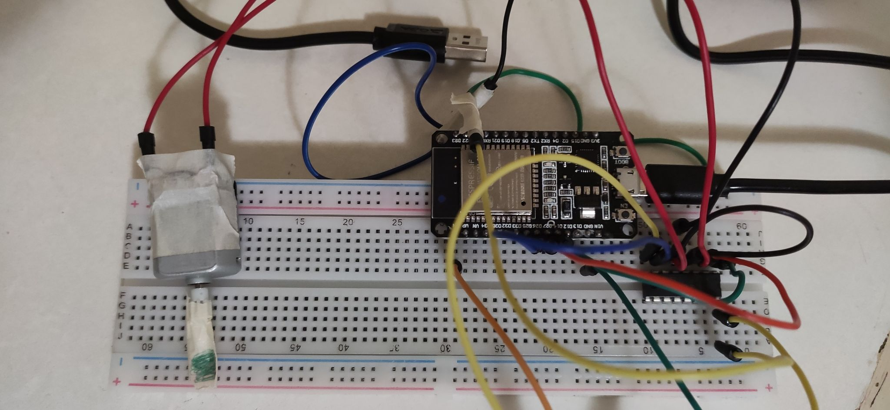
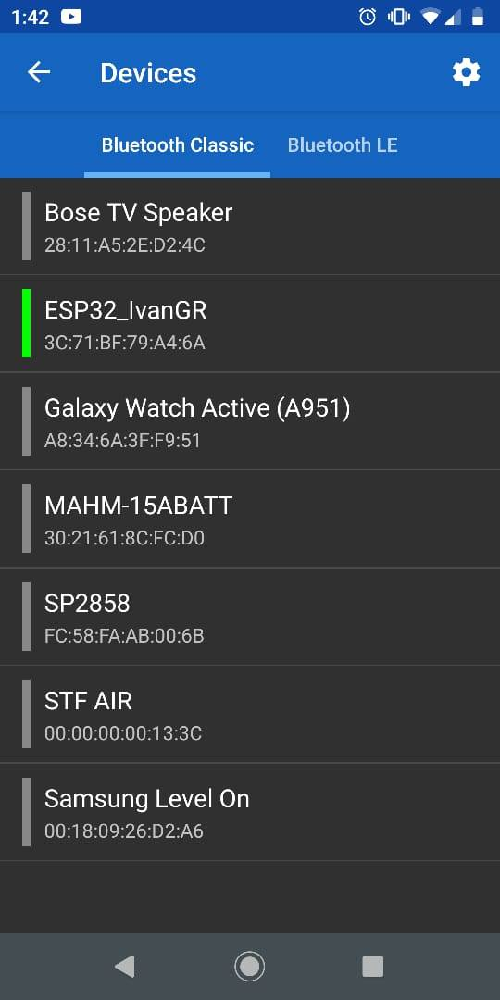
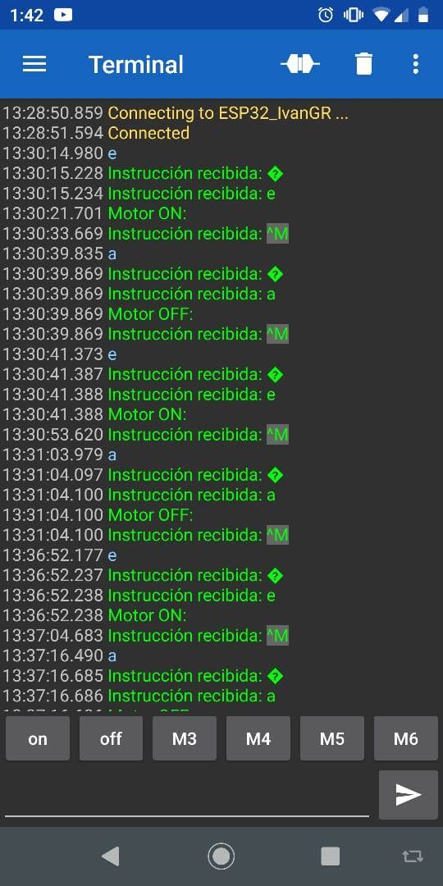
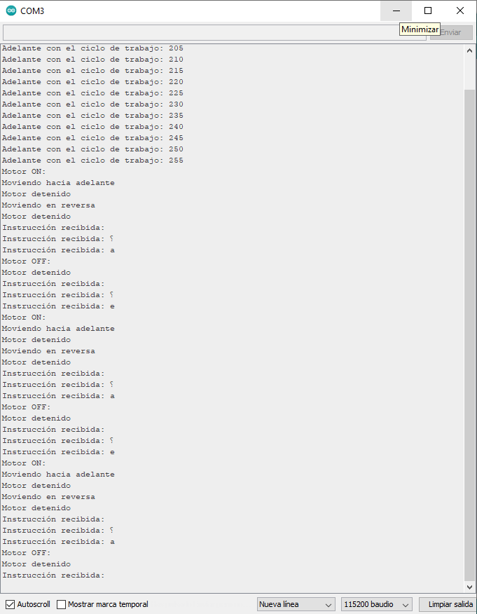

# :trophy: A4.1 Actividad de aprendizaje

Circuito de control para activar y desactivar un motor DC, utilizando  NodeMCU ESP32 por medio de Bluetooth
___

## Instrucciones

- Realizar un sistema ensamblado de control por medio de **Bluetooth**, capaz de control a un motor DC, utilizando un NodeMCU **ESP32**, un y un **IC L293D**.
- Toda actividad o reto se deberá realizar utilizando el estilo **MarkDown con extension .md** y el entorno de desarrollo VSCode, debiendo ser elaborado como un documento **single page**, es decir si el documento cuanta con imágenes, enlaces o cualquier documento externo debe ser accedido desde etiquetas y enlaces, y debe ser nombrado con la nomenclatura **A4.1_NombreApellido_Equipo.pdf.**
- Es requisito que el .md contenga una etiqueta del enlace al repositorio de su documento en GITHUB, por ejemplo **Enlace a mi GitHub** y al concluir el reto se deberá subir a github.
- Desde el archivo **.md** exporte un archivo **.pdf** que deberá subirse a classroom dentro de su apartado correspondiente, sirviendo como evidencia de su entrega, ya que siendo la plataforma **oficial** aquí se recibirá la calificación de su actividad.
- Considerando que el archivo .PDF, el cual fue obtenido desde archivo .MD, ambos deben ser idénticos.
- Su repositorio ademas de que debe contar con un archivo **readme**.md dentro de su directorio raíz, con la información como datos del estudiante, equipo de trabajo, materia, carrera, datos del asesor, e incluso logotipo o imágenes, debe tener un apartado de contenidos o indice, los cuales realmente son ligas o **enlaces a sus documentos .md**, _evite utilizar texto_ para indicar enlaces internos o externo.
- Se propone una estructura tal como esta indicada abajo, sin embargo puede utilizarse cualquier otra que le apoye para organizar su repositorio.
  
```
- readme.md
  - blog
    - C4.1_TituloActividad.md
    - C4.2_TituloActividad.md
    - C4.3_TituloActividad.md
    - C4.4_TituloActividad.md    
  - img
  - docs
    - A4.1_TituloActividad.md
    - A4.2_TituloActividad.md
    - A4.3_TituloActividad.md
```
___

### Fuentes de apoyo para desarrollar la actividad

- [x] [Random Nerd Tutorial DHT Humedad y temperatura](https://randomnerdtutorials.com/esp32-dht11-dht22-temperature-humidity-sensor-arduino-ide/)
- [x] [Motor DC con IC L293 y ESP32](https://www.hackster.io/Oniichan_is_ded/l293d-with-esp32-wemos-lolin-d32-v2-hacked-edition-ea2086)

___

## Desarrollo

1.Utilizar el siguiente listado de materiales para la elaboración de la actividad

| Cantidad | Descripción                                                                                                                                                                                                                |
| -------- | -------------------------------------------------------------------------------------------------------------------------------------------------------------------------------------------------------------------------- |
| 1        | [IC L293D](https://www.amazon.com.mx/330ohms-M%C3%B3dulo-Sensor-Humedad-Temperatura/dp/B07Q4KWJQY/ref=sr_1_1?__mk_es_MX=%C3%85M%C3%85%C5%BD%C3%95%C3%91&dchild=1&keywords=sensor+dht11&qid=1599003418&sr=8-1)             |
| 1        | Fuente de voltaje de 5V                                                                                                                                                                                                    |
| 1        | [NodeMCU ESP32](https://www.amazon.com.mx/ESP-32-ESP-32S-ESP-WROOM-32-ESP32-S-desarrollo/dp/B07TBFC75Z/ref=sr_1_2?__mk_es_MX=%C3%85M%C3%85%C5%BD%C3%95%C3%91&dchild=1&keywords=esp32&qid=1599003438&sr=8-2)                |
| 1        | [BreadBoard](https://www.amazon.com.mx/Deke-Home-Breadboard-distribuci%C3%B3n-electr%C3%B3nica/dp/B086C9HK7V/ref=sr_1_22?__mk_es_MX=%C3%85M%C3%85%C5%BD%C3%95%C3%91&dchild=1&keywords=breadboard&qid=1599003455&sr=8-22)   |
| 1        | [Jumpers M/M](https://www.amazon.com.mx/ELEGOO-Macho-Hembra-Macho-Macho-Hembra-Hembra-Protoboard/dp/B06ZXSQ5WG/ref=sr_1_1?__mk_es_MX=%C3%85M%C3%85%C5%BD%C3%95%C3%91&dchild=1&keywords=jumper+wires&qid=1599003519&sr=8-1) |
| 1| [Motor Reductor](https://www.steren.com.mx/motor-reductor-de-doble-eje-tipo-i-3-vcc.html) |

2. Basado en las imágenes que se muestran en las **Figura 1**, ensamblar un circuito electrónico, con la finalidad de obtener un sistema capaz de cumplir con las instrucciones siguientes:
   
  + Por medio de la aplicación "Serial Bluetooth terminal" que puede ser descargada del play Store de google o incluso cualquier otra que considere, se deberá controlar el arranque y apagado de un motor DC, es decir se contara con dos peticiones, la cual una de ellas representara el **"START" y la otra opción "STOP"**
  + El motor debe ser capaz de girar a favor de las manecillas del reloj durante 5 segundos, al cumplirse ese tiempo debe frenar 1 segundo e invertirá su giro durante otros 5 segundos, es decir la actividad debe tener la secuencia siguiente: El **stop** puede ser ejecutado en cualquier instante, y el motor estará ejecutando 5s en forward, 1s stop, 5s reverse, 1s stop, 5s forward, 1s stop, 5s reverse,...
    
<p align="center"> 
    <strong>Figura 1 Circuito ESP32 IC L293 Motor DC</strong>
    
</p>

3. Coloque aquí la imagen del circuito ensamblado

   <p align="center">
       
  </p>

4. Coloque en este lugar el programa creado dentro del entorno de Arduino
```c++
#include "BluetoothSerial.h"

#if !defined(CONFIG_BT_ENABLED) || !defined(CONFIG_BLUEDROID_ENABLED)
#error Bluetooth is not enabled! Please run `make menuconfig` to and enable it
#endif

BluetoothSerial SerialBT;
//Guardamos el valor que vamos a recibir 
int received;
//El valor que guardamos arriba lo guardamos aqui como CHAR
char receivedChar;

const char turnON ='e';
const char turnOFF ='a';

int motor1Pin1 = 27; 
int motor1Pin2 = 26; 
int enable1Pin = 14; 
 
// Setting PWM properties
const int freq = 10000;
const int pwmChannel = 0;
const int resolution = 8;
int dutyCycle = 200;

 
void setup() {
  Serial.begin(115200);
  //Le ponemos el nombre que queramos a nuestro esp32
  SerialBT.begin("ESP32_IvanGR"); 
  Serial.println("El dispositivo a iniciado, ya puedes usar con bluetooth!");
  //Esto se imprime en el smonitor de arduino
  Serial.println("Para encender el motor envia: e");  
  Serial.println("Para apagar el motor envia: a"); 
  
  // sets the pins as outputs:
  pinMode(motor1Pin1, OUTPUT);
  pinMode(motor1Pin2, OUTPUT);
  pinMode(enable1Pin, OUTPUT);
  
  // configure LED PWM functionalitites
  ledcSetup(pwmChannel, freq, resolution);
  
  // attach the channel to the GPIO to be controlled
  ledcAttachPin(enable1Pin, pwmChannel);
 

}
 
void loop() {

    //Aqui le asignamos la variable para guardar lo que va a leer como instruccion
    receivedChar =(char)SerialBT.read();
  //Si el serial esta disponible entonces escribe lo que recibio
  if (Serial.available()) {
    SerialBT.write(Serial.read());
  
  }
  //Si el serailBT esta disponible entonces le manda las lineas siguientes
  if (SerialBT.available()) {
    //Esto aparece en la app
    SerialBT.print("Instrucción recibida: ");
    //Aqui imprime la intruccion que se ingreso
    SerialBT.println(receivedChar);
    
         
    Serial.print ("Instrucción recibida: ");
    Serial.println(receivedChar);

     if(receivedChar == turnON)
    {
          
      //Se declara el cilo de trabajo
        while (dutyCycle <= 255){
    ledcWrite(pwmChannel, dutyCycle);   
    Serial.print("Adelante con el ciclo de trabajo: ");
    Serial.println(dutyCycle);
    dutyCycle = dutyCycle + 5;
    delay(500);
         }
  dutyCycle = 200;
 
     SerialBT.println("Motor ON: ");
     Serial.println("Motor ON: ");
     // Mueve el motor dc hacia adelante a maxima velocidad
    Serial.println("Moviendo hacia adelante");
    digitalWrite(motor1Pin1, LOW);
    digitalWrite(motor1Pin2, HIGH); 
    delay(5000);
 
    // Detiene el motor
    Serial.println("Motor detenido");
    digitalWrite(motor1Pin1, LOW);
    digitalWrite(motor1Pin2, LOW);
    delay(1000);
 
    // Mueve el motor dc en reversa a maxima velocidad
    Serial.println("Moviendo en reversa");
    digitalWrite(motor1Pin1, HIGH);
    digitalWrite(motor1Pin2, LOW); 
    delay(5000);
 
    // Detiene el motor
    Serial.println("Motor detenido");
    digitalWrite(motor1Pin1, LOW);
    digitalWrite(motor1Pin2, LOW);
    delay(1000);
 
    // Mueve el motor dc en reversa incrementando la velocidad
    digitalWrite(motor1Pin1, HIGH);
    digitalWrite(motor1Pin2, LOW);
   
       
    }
        //Si la intruccion es igual a TurnOFF (a), entonces apaga el motor y le dice que esta apagado tanto en arduino como en la app
    if(receivedChar == turnOFF)
    {
     dutyCycle = 256;
     SerialBT.println("Motor OFF: ");
     Serial.println("Motor OFF: ");
     Serial.println("Motor detenido");
     digitalWrite(motor1Pin1, LOW);
     digitalWrite(motor1Pin2, LOW);
    } 
    
    }

}
```
5. Coloque aquí evidencias que considere importantes durante el desarrollo de la actividad.
   
   <p align="center">
       
  </p>

   <p align="center">
       
  </p>

   <p align="center">
       
  </p>

   <p align="center">
       
  </p>

   <p align="center">
       
  </p>

   <p align="center">
       
  </p>

  <p align="center">
       
  </p>


6. Conclusiones

   **Garcia Rosas Ivan**
   
    Durante el proceso de armado y codificación todo fue sencillo de entender, y al final el motor cumple con las condiciones, a excepción de un solo detalle, y es que ocupa de “ayuda” para iniciar el giro, por lo demás todo funciono bien, esto abre las posibilidades a otros proyectos como robots simples, o algún mecanismo que no requiera de mucha fuerza de giro en la que se puedan usar este tipo de motores con el puente como control.

    **Vanessa Marquez**

    Se pudo demostrar atravez de la practica que con el mismo principio que se realizo en la practica pasada de un led se pueden lograr cosas mucho mas complejas y con el echo de poder encender un motor podemos hacer mucho mas ya que el motor es lo que le da vida a un sin fin de dispositivos.

:video_camera: [Ir a la demostración en video](https://youtu.be/tIFS4RSOw7c)

___

### :bomb: Rubrica

| Criterios     | Descripción                                                                                  | Puntaje |
| ------------- | -------------------------------------------------------------------------------------------- | ------- |
| Instrucciones | Se cumple con cada uno de los puntos indicados dentro del apartado Instrucciones?            | 10      |
| Desarrollo    | Se respondió a cada uno de los puntos solicitados dentro del desarrollo de la actividad?     | 60      |
| Demostración  | El alumno se presenta durante la explicación de la funcionalidad de la actividad?            | 20      |
| Conclusiones  | Se incluye una opinión personal de la actividad  por cada uno de los integrantes del equipo? | 10      |


:house: [Ir a GitHub - Garcia Rosas Ivan](https://github.com/GarciaRosasIvan/GarciaRosasIvan_SistemasProgramables/blob/master/README.md)

:house: [Ir a GitHub - Marquez Millan Seashell Vanessa](https://github.com/seashelltec/SistemasProgramables)
