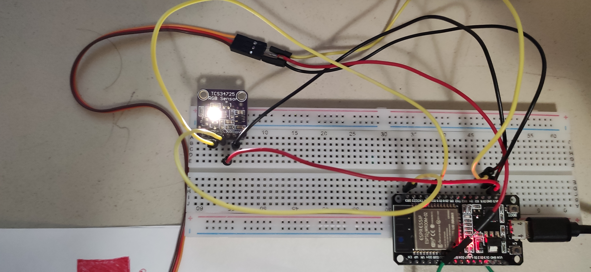
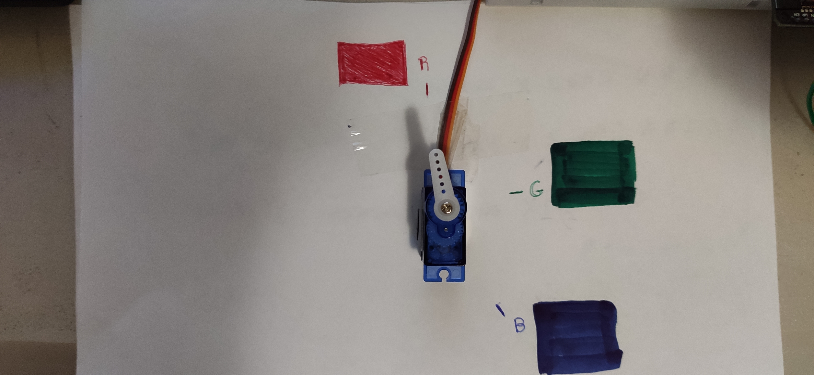
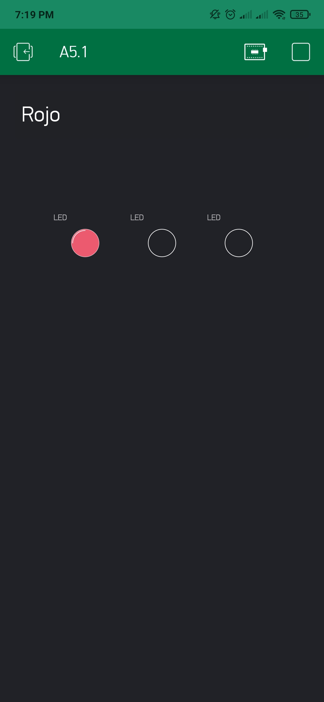
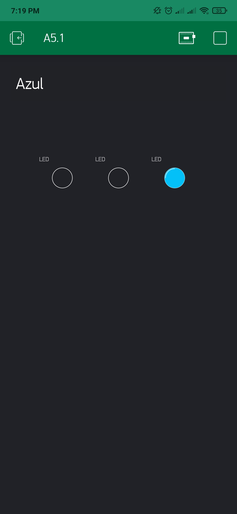
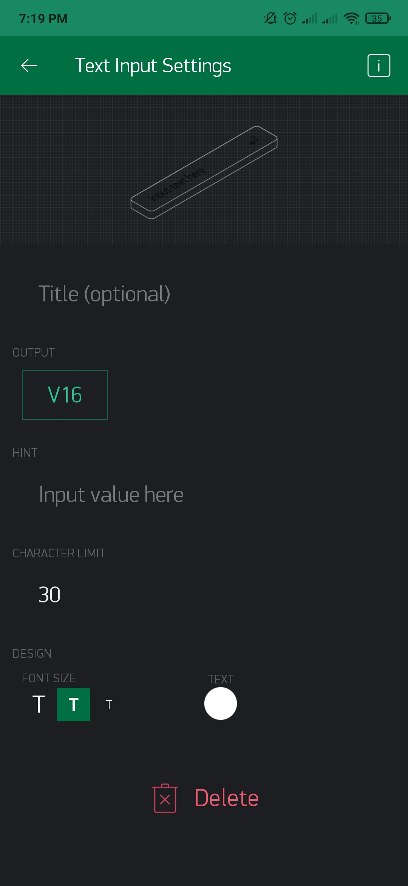
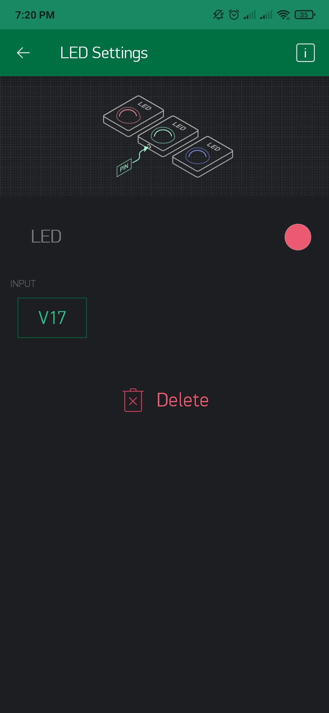
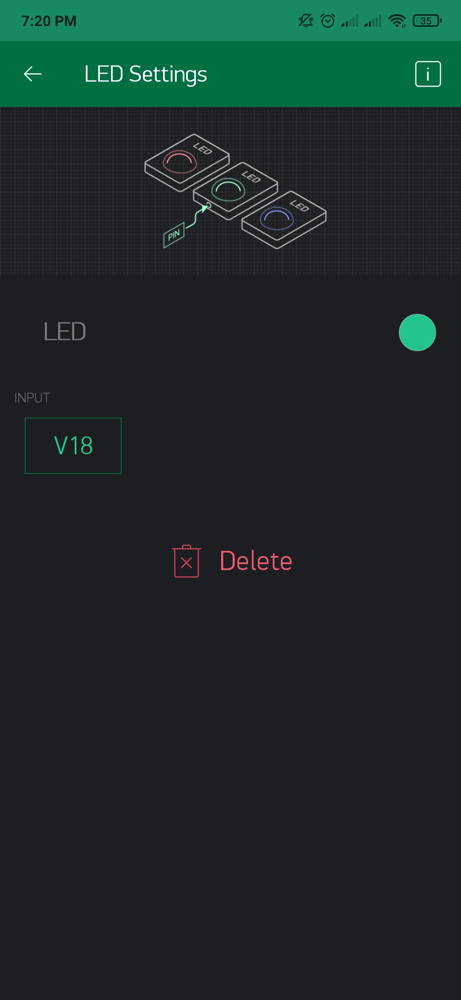
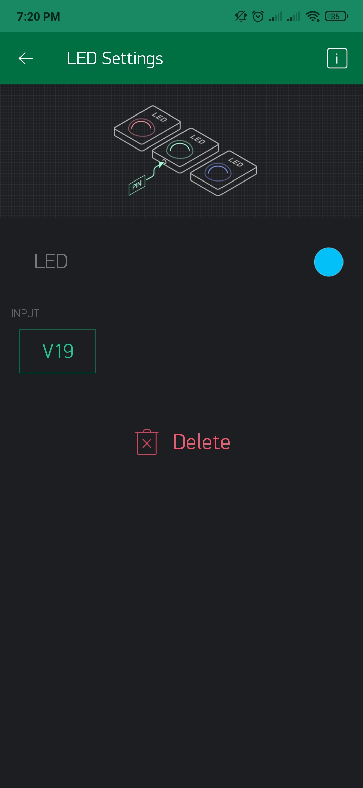
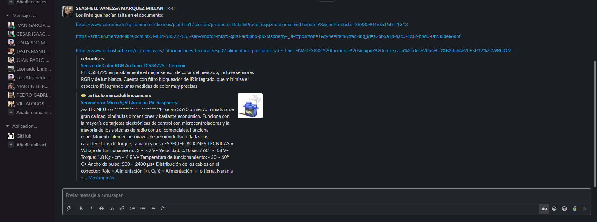

# :trophy: A5.2 Actividad de aprendizaje

Sistema sensor y actuacion del color de un objeto, e interface visual
___

## Instrucciones

- Realizar un sistema de identificacion de color utilizando un sensor de RGB TCS34725, un nodeMCU ESP32, un actuador Servomotor SG90, cualquier protocolo de comunicación y una interface visual que puede ser desarrollada por el equipo o apoyandose de otras como Node-red por ejemplo.
- Toda actividad o reto se deberá realizar utilizando el estilo **MarkDown con extension .md** y el entorno de desarrollo VSCode, debiendo ser elaborado como un documento **single page**, es decir si el documento cuanta con imágenes, enlaces o cualquier documento externo debe ser accedido desde etiquetas y enlaces, y debe ser nombrado con la nomenclatura **A5.2_NombreApellido_Equipo.pdf.**
- Es requisito que el .md contenga una etiqueta del enlace al repositorio de su documento en GITHUB, por ejemplo **Enlace a mi GitHub** y al concluir el reto se deberá subir a github.
- Desde el archivo **.md** exporte un archivo **.pdf** que deberá subirse a classroom dentro de su apartado correspondiente, sirviendo como evidencia de su entrega, ya que siendo la plataforma **oficial** aquí se recibirá la calificación de su actividad.
- Considerando que el archivo .PDF, el cual fue obtenido desde archivo .MD, ambos deben ser idénticos.
- Su repositorio ademas de que debe contar con un archivo **readme**.md dentro de su directorio raíz, con la información como datos del estudiante, equipo de trabajo, materia, carrera, datos del asesor, e incluso logotipo o imágenes, debe tener un apartado de contenidos o indice, los cuales realmente son ligas o **enlaces a sus documentos .md**, _evite utilizar texto_ para indicar enlaces internos o externo.
- Se propone una estructura tal como esta indicada abajo, sin embargo puede utilizarse cualquier otra que le apoye para organizar su repositorio.
  
```
- readme.md
  - blog
    - C5.1_TituloActividad.md
    - C5.2_TituloActividad.md    
  - img
  - docs
    - A5.1_TituloActividad.md
    - A5.2_TituloActividad.md    
```

___

## Desarrollo

1. Utilizar el siguiente listado de materiales para la elaboración de la actividad

| Cantidad | Descripción    |
| -------- | -------------- |
| 1        | [Sensor RGB TCS34725](https://www.cetronic.es/sqlcommerce/disenos/plantilla1/seccion/producto/DetalleProducto.jsp?idIdioma=&idTienda=93&codProducto=888304046&cPath=1343) |
| 1 | [Servomotor SG90](https://articulo.mercadolibre.com.mx/MLM-585222055-servomotor-micro-sg90-arduino-pic-raspberry-_JM#position=1&type=item&tracking_id=a2bb5a1d-aac0-4ca2-bbd0-0f236dee6d6f) |
| 1        |[Fuente de voltaje de 5V](https://www.radioshuttle.de/es/medias-es/informaciones-tecnicas/esp32-alimentado-por-bateria/#:~:text=El%20ESP32%20funciona%20siempre%20entre,caso%20del%20m%C3%B3dulo%20ESP32%20WROOM.)                                                                                                                                          |
| 1        | [NodeMCU ESP32](https://www.amazon.com.mx/ESP-32-ESP-32S-ESP-WROOM-32-ESP32-S-desarrollo/dp/B07TBFC75Z/ref=sr_1_2?__mk_es_MX=%C3%85M%C3%85%C5%BD%C3%95%C3%91&dchild=1&keywords=esp32&qid=1599003438&sr=8-2)                |
| 1        | [BreadBoard](https://www.amazon.com.mx/Deke-Home-Breadboard-distribuci%C3%B3n-electr%C3%B3nica/dp/B086C9HK7V/ref=sr_1_22?__mk_es_MX=%C3%85M%C3%85%C5%BD%C3%95%C3%91&dchild=1&keywords=breadboard&qid=1599003455&sr=8-22)   |
| 1        | [Jumpers M/M](https://www.amazon.com.mx/ELEGOO-Macho-Hembra-Macho-Macho-Hembra-Hembra-Protoboard/dp/B06ZXSQ5WG/ref=sr_1_1?__mk_es_MX=%C3%85M%C3%85%C5%BD%C3%95%C3%91&dchild=1&keywords=jumper+wires&qid=1599003519&sr=8-1) |

2. Basado en las imágenes que se muestran en las **Figura 1**, realizar un sistema capaz de cumplir con las siguientes condiciones:
   
   - La primer fase de la actividad consistira en, al colocar un objeto frente al sensor RGB, este debera identificar que color tiene (es recomendable utiizar objetos de color Rojo, Verde, y Azul para mayor precision), el cual debera mostrar en un interface visual que color fue detectado.
   - La segunda fase, consistira en agregar un actuador que y un identificador de color apoyandose de una banda de colores como se muestra en la imagen 1; al conocer el color del objeto el actuador debera apuntar al color que se esta detectando.

 <p align="center"> 
    <strong>Figura 1 Circuito ESP32 Sensor de color y Servomotor</strong>
    
</p>

3. Coloque aquí la imagen del circuito ensamblado
   
  <p align="center">
       
  </p>

4. Coloque en este lugar el programa creado dentro del entorno de Arduino
```c++
#include <BlynkSimpleEsp32.h>
#include <Wire.h>
#define BLYNK_PRINT Serial
#include <WiFi.h>
#include <WiFiClient.h>
#include <Servo_ESP32.h>
#include "Adafruit_TCS34725.h"

//Token generado por la aplicacion
char tok[] = "bI-FVLbSmuyMEdKdyjfqHkDFVi-2uBKE";


//Datos para la conexion
char ssid[] = "INFINITUM8AC8_2.4";
char pass[] = "qKS3y6uAS3";

WidgetLED led1(V17);//Rojo
WidgetLED led2(V18);//Verde
WidgetLED led3(V19);//Azul

// Objetos
Adafruit_TCS34725 tcs = Adafruit_TCS34725(TCS34725_INTEGRATIONTIME_700MS, TCS34725_GAIN_1X);
Servo_ESP32 servo;
const int SDAPin = 21;
const int SCLPin = 23;


// variables
static const int servoPin = 15;

float red, green, blue;

void setup() {
  Serial.begin(115200);
  Blynk.begin(tok, ssid, pass);
  
  servo.attach(servoPin);

  Wire.begin(SDAPin, SCLPin);

  if (!tcs.begin())
  {
    Serial.println("Error al iniciar TCS34725");
    while (1) delay(1000);
  }

}

//////////////////////////////Funcion para el Sensor y Servo//////////////////////////////////////////
void DeteccionYMov(){

  tcs.getRGB(&red,&green,&blue);
  if(red > green && red > blue){
      
      servo.write(180);
      Serial.println("Rojo"); 

      BLYNK_WRITE(V16);
      Blynk.virtualWrite(V16, "Rojo");
      led1.on();
      led2.off();
      led3.off();
    }
    else if(green > blue){
      servo.write(90);
      Serial.println("Verde");

      BLYNK_WRITE(V16);
      Blynk.virtualWrite(V16, "Verde");
      led2.on();
      led1.off();
      led3.off();
  }
  else{
    servo.write(0);
    Serial.println("Azul"); 

     BLYNK_WRITE(V16);
      Blynk.virtualWrite(V16, "Azul");
      led3.on();
      led2.off();
      led1.off();
    }
 }
/////////////////////////////////////////////////////////////////////////////////////////////////


void loop() {
  
      DeteccionYMov();
      Blynk.run();
}
```

5. Coloque aquí evidencias que considere importantes durante el desarrollo de la actividad.

  <p align="center">
       
  </p>

  <p align="center">
       
  </p>

  <p align="center">
       
  </p>

  <p align="center">
       
  </p>

  <p align="center">
       
  </p>
  
  <p align="center">
       
  </p>

  <p align="center">
       
  </p>
  
  <p align="center">
       
  </p>

  <p align="center">
       
  </p>

  <p align="center">
       
  </p>

  <p align="center">
       
  </p>

6. Para la demostracion de la actividad deberan utilizarse mas de un objeto para poder cubrir minimo tres colores.

7. Conclusiones

 **Marquez Millan Seashell Vanessa**
    
  En esta práctica obtuvimos más problemas de los que tal vez pensábamos que íbamos a tener ya que aunque logramos hacer el programa en node-red y anteriormente hacer la instalación correcta de dicha aplicación, también hicimos el programa de la forma que nosotros no encontramos algún error, de igual forma aprendimos mucho con estos errores ya que al intentar buscar la solución tuvimos la necesidad de buscar más, en lo personal node-red me gusto mucho ya que tiene ciertas librerías que contienen más formas que hacen más sencillas algunas funciones, aunque decía que estaba conectado, no pude realizar la transferencia de datos, pero me parece una herramienta eficaz, en la parte general del proyecto creo que fue una buena práctica final.
   
  **Garcia Rosas Ivan**
   
  Tuvimos muchos problemas al inicio ya que nos daban error las librerías referentes al sensor TCS34725, después nos topamos con que teníamos un error en la conexión de node-red que antes no teníamos, sin poder llegar a una solución, se decidió usar Blynk para hacer el dashboard y la conexión WiFi, aquí no hubo inconveniente y todo fue de manera fluida, en cuanto al sensor, se le pueden sacar varios usos, como separadores de dulces, objetos u otras cosas a las que se quiera clasificar por color, claro que en la industria se podría usar, pero no este modelo. Otro punto a resaltar es que en nuestro caso el motor no giraba con 3.3V y tuvimos que cambiarlo a 5V, por otro lado, con este servomotor es más que suficiente para tareas pequeñas como esta que solo señala un punto en concreto y no mueve nada, de quererlo así, deberíamos comprar uno con mayor potencia.

:video_camera: [Ir a la demostración en video](https://youtu.be/YD0pEnwaAR8)
___

### :bomb: Rubrica

| Criterios     | Descripción                                                                                  | Puntaje |
| ------------- | -------------------------------------------------------------------------------------------- | ------- |
| Instrucciones | Se cumple con cada uno de los puntos indicados dentro del apartado Instrucciones?            | 10      |
| Desarrollo    | Se respondió a cada uno de los puntos solicitados dentro del desarrollo de la actividad?     | 60      |
| Demostración  | El alumno se presenta durante la explicación de la funcionalidad de la actividad?            | 20      |
| Conclusiones  | Se incluye una opinión personal de la actividad  por cada uno de los integrantes del equipo? | 10      |

:house: [Ir a GitHub - Marquez Millan Seashell Vanessa](https://github.com/seashelltec/SistemasProgramables)

:house: [Ir a GitHub - Garcia Rosas Ivan](https://github.com/GarciaRosasIvan/GarciaRosasIvan_SistemasProgramables/blob/master/README.md)